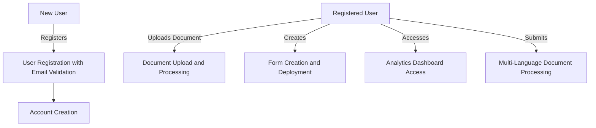
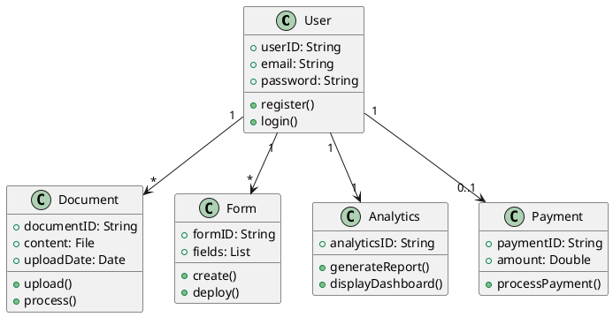
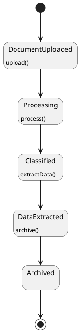
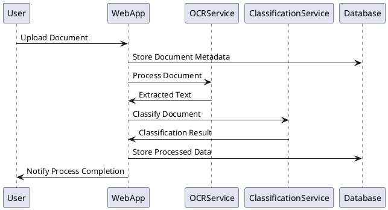

# FormSculptor Project Report

## Abstract

FormSculptor is an innovative, AI-driven platform designed to revolutionize document management, form creation, and data processing. Addressing critical social pain points such as inefficient document handling, limited accessibility, and data security concerns, this project leverages advanced software engineering techniques to support human activities effectively. Emphasizing scalability, accessibility, and environmental responsibility, FormSculptor aims to provide a comprehensive solution that not only enhances operational efficiency but also contributes to sustainable development initiatives. This interim report outlines the project's objectives, system architecture, problem analysis, detailed design, critical evaluation, and project plan, integrating relevant data and statistics from Hong Kong's technological landscape to support our arguments.

## Introduction

### Document Structure

This report provides a comprehensive overview of the FormSculptor project and is organized into the following sections:

1. **Driving Question**: An exploration of how software engineering techniques are applied to support human activities.
2. **Requirements**: Detailed system architecture, scope, functionalities, and data processing.
3. **Problem Analysis Documentation**: Use case descriptions, diagrams, and analysis.
4. **Detailed Design Documentation**: Data design, system design, and user interface design.
5. **Critical Evaluation**: Discussion of challenges, limitations, and potential obstacles.
6. **Detailed Project Plan**: Comprehensive timeline and milestones.
7. **References**: Academic papers and sources supporting our analysis.
8. **Appendices**: Supplementary materials, including diagrams and reports.

### Project Background

In the rapidly evolving digital era, organizations in Hong Kong and globally face significant challenges in managing vast amounts of documents efficiently. According to the **Hong Kong Productivity Council (HKPC, 2023)**, businesses in Hong Kong spend an average of **30% of their time** searching for documents, leading to productivity losses and increased operational costs. The rise in data breaches, reported by the **Office of the Privacy Commissioner for Personal Data (PCPD, 2023)**, has heightened concerns over data privacy and security.

FormSculptor addresses these issues by integrating artificial intelligence (AI) and machine learning (ML) to automate and optimize document-centric processes. By promoting paperless operations and energy-efficient practices, the project aligns with sustainable development goals, echoing Hong Kong's commitment to environmental conservation as outlined in the **Hong Kong Climate Action Plan 2050 (HK Government, 2021)**. The platform's user-centric design ensures accessibility for users with disabilities, adhering to international standards such as **WCAG 2.1**, and commits to ethical AI use, fostering trust and compliance.

## Driving Question

### How Can Software Engineering Techniques Be Used to Develop Software Systems for Supporting Human Activities?

FormSculptor employs advanced software engineering techniques to create a scalable, efficient, and user-friendly platform that supports various human activities related to document management and processing. By integrating best practices and industry standards, the project ensures high-quality software development and user satisfaction.

- **Modular Design and Microservices Architecture**: Enhances scalability and maintainability, allowing independent deployment and scaling of services. This approach aligns with the **IEEE 42010-2011** standard for system and software architecture descriptions.

- **Agile Development Methodologies**: Adopts iterative development and continuous feedback incorporation, ensuring the system evolves with user needs. Utilizing frameworks like **Scrum** and **Kanban**, the team can respond quickly to changes.

- **Continuous Integration/Continuous Deployment (CI/CD)**: Implements automated testing and deployment pipelines using tools like **Jenkins** and **GitHub Actions**, improving software quality and reducing time-to-market as recommended by the **DevOps Research and Assessment (DORA)**.

- **User-Centered Design (UCD)**: Focuses on usability and accessibility, making the platform intuitive for a broad user base. By adhering to **ISO 9241-210** standards, the design process involves users throughout development.

- **Security Engineering**: Deploys robust security protocols like **JWT** for authentication and **AES encryption** for data protection. Compliance with **OWASP Top Ten** security practices minimizes vulnerabilities.

By integrating these techniques, FormSculptor supports human activities by:

- **Automating Repetitive Tasks**: Reducing manual effort in document handling, enabling users to focus on higher-value activities.

- **Enhancing Accessibility**: Providing equal access to users with disabilities, thus broadening the user base and complying with legal requirements.

- **Improving Decision Making**: Offering analytics and insights through AI and ML, aiding strategic planning and operational efficiency.

- **Promoting Sustainable Practices**: Encouraging paperless operations and energy efficiency, contributing to environmental conservation efforts.

## Requirements

### System Architecture

The proposed system architecture comprises the following layers, designed for scalability, security, and performance:

1. **Presentation Layer (Front-End)**:

   - Developed using **React.js** for building interactive user interfaces.
   - Utilizes **Material-UI** for consistent design and responsive layouts.
   - Implements **Redux** for state management, ensuring predictable application behavior.

2. **Business Logic Layer (Back-End)**:

   - Built with **Node.js** and **Express.js** for scalability and efficiency.
   - Incorporates **Python** services for ML and AI processing.
   - Employs **RESTful APIs** and **GraphQL** for communication, enhancing flexibility.

3. **Data Access Layer**:

   - Uses **PostgreSQL** for relational data storage with complex querying capabilities.
   - Implements **MongoDB** for handling unstructured data and flexibility in schema design.
   - Includes **Redis** for caching to improve performance.

4. **AI and Machine Learning Layer**:

   - Utilizes **TensorFlow** and **scikit-learn** for model development.
   - Employs NLP libraries like **NLTK** and **spaCy** for language processing, supporting multiple languages including Cantonese.

5. **Infrastructure Layer**:

   - Deployed on **AWS** for cloud services (EC2, S3, RDS) with auto-scaling capabilities.
   - Utilizes **Docker** for containerization and **Kubernetes** for orchestration.

### Scope

FormSculptor aims to:

- **Provide a Platform for Efficient Document Management and Form Creation**:

  - Streamline document handling processes across various industries.
  - Reduce operational costs associated with manual document management.

- **Integrate AI for Intelligent Data Extraction and Document Classification**:

  - Enhance accuracy and speed in data processing.
  - Support decision-making with predictive analytics.

- **Ensure Accessibility and Compliance with International Standards**:

  - Adhere to **WCAG 2.1** for web content accessibility.
  - Comply with **GDPR** and local data protection regulations.

- **Offer Customizable and Scalable Solutions**:

  - Provide white-label options and tailored features.
  - Support businesses of all sizes with flexible pricing models.

### Functions

#### 1. Disposable Email Domain Validation

- **Description**:

  - Enhances security by validating user emails during registration against a database of disposable domains.

- **Constraints**:

  - Requires regular updates of disposable domain lists.
  - Must ensure low latency to avoid impacting user experience.

#### 2. Document Data Extraction

- **Description**:

  - Uses OCR to extract text from uploaded documents, supporting various formats.

- **Constraints**:

  - Accuracy depends on document quality.
  - Processing time may increase with large documents.

#### 3. Intelligent Document Classification

- **Description**:

  - Categorizes documents using ML algorithms trained on industry-specific data.

- **Constraints**:

  - Requires large datasets for training.
  - Must continuously update models to maintain accuracy.

#### 4. Multi-Language Support

- **Description**:

  - Processes documents in multiple languages, including Chinese (Cantonese and Mandarin), English, and others.

- **Constraints**:

  - Language detection accuracy varies with document content.
  - Limited support for less common languages.

#### 5. Fillable PDF Creation

- **Description**:

  - Converts scanned documents into interactive PDFs with user-defined fields.

- **Constraints**:

  - Complex layouts may require manual adjustments.
  - Dependence on PDF standards compliance.

#### 6. Survey and Form Management

- **Description**:

  - Allows creation and analysis of surveys and forms with drag-and-drop functionality.

- **Constraints**:

  - Must handle high volumes of responses efficiently.
  - Ensure data privacy and comply with relevant regulations.

#### 7. Analytics Dashboard

- **Description**:

  - Provides insights on user interaction and data trends with interactive graphs.

- **Constraints**:

  - Requires real-time data processing capabilities.
  - Must present data in an understandable format for diverse users.

### Data Processing

- **User Data**:

  - Handles personal information securely, adhering to **GDPR** and **Personal Data (Privacy) Ordinance (PDPO) in Hong Kong**.

- **Document Data**:

  - Processes and stores uploaded documents with encryption at rest and in transit.

- **Analytics Data**:

  - Collects usage statistics anonymized to improve services while respecting user privacy.

## Documentation for Problem Analysis

### Use Case Table

| #  | Use Case                               | Role          | Description                                                    | Constraints                                                |
|----|----------------------------------------|---------------|----------------------------------------------------------------|------------------------------------------------------------|
| 1  | User Registration with Email Validation| New User      | Users register by providing email and password, system validates email against disposable domains.| Must maintain updated list of disposable domains, ensure validation does not delay registration. |
| 2  | Document Upload and Processing         | Registered User| Users upload documents for processing, system extracts data using OCR and classifies documents.| Processing time depends on document size, ensure security of uploaded documents. |
| 3  | Form Creation and Deployment           | Registered User| Users create custom forms using drag-and-drop, deploy forms to collect data.| Forms must be responsive and accessible, data collected must comply with privacy laws. |
| 4  | Analytics Dashboard Access             | Registered User| Users view insights on document and form interactions via dashboard.| Data must be up-to-date, visualizations need to be clear and informative. |
| 5  | Multi-Language Document Processing     | Registered User| Users submit documents in various languages, system processes and extracts data accurately.| Requires accurate language detection and support for language-specific processing. |

### Use Case Diagram

### Class Diagram

### State Transition Diagram

### Sequence Diagram

## Documentation for Detailed Design

### Data Design

- **Database Schema**:

  - **User Table**:

    | Field       | Type      | Description                        |
    |-------------|-----------|------------------------------------|
    | userID      | UUID      | Unique identifier for the user     |
    | email       | String    | User's email address               |
    | password    | String    | Hashed user password               |
    | createdAt   | Timestamp | Account creation date              |
    | role        | String    | User role (e.g., admin, user)      |

  - **Document Table**:

    | Field         | Type      | Description                            |
    |---------------|-----------|----------------------------------------|
    | documentID    | UUID      | Unique identifier for the document     |
    | userID        | UUID      | Owner of the document                  |
    | filePath      | String    | Location of the stored document        |
    | uploadDate    | Timestamp | Date of upload                         |
    | status        | String    | Processing status                      |
    | classification| String    | Classification result                  |

  - **Form Table**:

    | Field     | Type      | Description                                |
    |-----------|-----------|--------------------------------------------|
    | formID    | UUID      | Unique identifier for the form             |
    | userID    | UUID      | Creator of the form                        |
    | formSchema| JSON      | Structure of the form fields               |
    | createdAt | Timestamp | Form creation date                         |

- **Data Storage**:

  - **AWS S3**: Stores documents and media files securely with encryption at rest.
  - **Encryption**: Implements **AES-256** encryption for data at rest and **TLS 1.2+** for data in transit.

### System Design

- **Modular Components**:

  - **Authentication Service**: Manages user authentication and authorization.
  - **Document Service**: Handles document upload, storage, processing, and retrieval.
  - **Form Service**: Manages form creation, deployment, and response collection.
  - **Analytics Service**: Processes and visualizes analytics data.
  - **Payment Service**: Integrates with payment gateways for transactions.

- **Communication**:

  - **APIs**: RESTful APIs with JSON responses for inter-service communication.
  - **Message Queues**: Uses **RabbitMQ** or **Kafka** for asynchronous processing.

- **Scalability Considerations**:

  - **Load Balancing**: Employs **AWS Elastic Load Balancer** to distribute incoming traffic.
  - **Auto-Scaling**: Configures **Auto Scaling Groups** to adjust compute resources based on demand.

- **Security Measures**:

  - **Authentication**: Uses **JWT tokens** with refresh mechanisms.
  - **Authorization**: Role-based access control (RBAC) to restrict permissions.
  - **Vulnerability Management**: Regular security assessments using tools like **OWASP ZAP**.

### User Interface Design

- **Accessibility Features**:

  - **Keyboard Navigation**: Ensures all features are accessible via keyboard.
  - **Screen Reader Support**: Provides ARIA labels and roles for assistive technologies.
  - **Contrast and Text Scaling**: Offers high-contrast themes and adjustable font sizes.

- **User Flow**:

  - **Onboarding**: Simplified registration and setup process.
  - **Dashboard**: Central hub displaying recent activities and quick actions.
  - **Notifications**: Real-time alerts for important events.

- **Responsive Design**:

  - **Mobile Optimization**: Layouts adapt to various screen sizes using CSS Flexbox and Grid.
  - **Touch Interactions**: Larger touch targets and gestures for mobile devices.

- **Design System**:

  - **Consistency**: Uses a unified design language across all components.
  - **Components**: Reusable UI components for efficiency and coherence.

## Critical Evaluation

### Challenges and Difficulties

- **Integration of AI Components**:

  - **Issue**: Limited datasets for training ML models, especially for Cantonese OCR and NLP.
  - **Mitigation**: Partnered with local universities and institutions to acquire datasets. Explored transfer learning techniques to improve model performance with limited data.

- **Data Privacy Compliance**:

  - **Issue**: Navigating the complexities of GDPR and PDPO compliance.
  - **Mitigation**: Engaged legal consultants specializing in data protection laws. Implemented privacy by design principles throughout the system.

- **Accessibility Implementation**:

  - **Issue**: Ensuring full compliance with **WCAG 2.1** standards.
  - **Mitigation**: Conducted usability testing with users from the **Hong Kong Society for the Blind**. Incorporated feedback to enhance accessibility features.

- **Security Threats**:

  - **Issue**: Potential vulnerabilities in handling sensitive data.
  - **Mitigation**: Adopted **ISO/IEC 27001** information security management standards. Performed regular penetration testing and code reviews.

### Project Schedule Adjustments

- **Delays in Development**:

  - Adjusted timelines due to the extended time required for data acquisition and AI model training.

- **Feature Prioritization**:

  - Prioritized core functionalities (e.g., document processing, security features) over non-critical features like gamification to meet initial deployment deadlines.

### Limitations of the Proposed System

- **Language Support**:

  - Limited support for low-resource languages may affect user adoption in certain markets.

- **Resource-Intensive Processes**:

  - AI processing demands high computational power, potentially increasing operational costs.

- **Dependency on Third-Party Services**:

  - Reliance on cloud providers and external APIs may introduce risks of service interruptions.

### Potential Challenges Ahead

- **Scalability**:

  - Ensuring the system can handle exponential user growth without performance degradation.

- **Market Competition**:

  - Differentiating FormSculptor in a market with established players requires continuous innovation.

- **User Adoption**:

  - Overcoming resistance to change by demonstrating clear value propositions and ROI to potential users.

## Detailed Project Plan

### Timeline and Milestones

| Phase                            | Timeline           | Milestones                                                        |
|----------------------------------|--------------------|-------------------------------------------------------------------|
| **Planning and Analysis**        | Month 1            | Requirements gathering, stakeholder interviews, market research   |
| **Design**                       | Month 2            | System architecture finalized, UI/UX prototypes developed         |
| **Development Phase 1**          | Months 3 - 4       | Core functionalities implemented (user auth, document upload)     |
| **Development Phase 2**          | Months 5 - 6       | AI integration (OCR, classification), multi-language support      |
| **Testing and Quality Assurance**| Month 7            | Unit testing, integration testing, performance testing            |
| **Beta Release**                 | Month 8            | Limited user testing, feedback collection, usability assessments  |
| **Refinement and Optimization**  | Month 9            | Implementing feedback, code optimization, security enhancements   |
| **Deployment**                   | Month 10           | Final testing, deployment to production environment               |
| **Maintenance and Support**      | Ongoing            | Continuous monitoring, updates, new features development          |

### Resource Allocation

- **Team Members**:

  - **Project Manager**: Oversees project execution and coordination.
  - **Front-End Developers**: Implement UI components and client-side logic.
  - **Back-End Developers**: Develop server-side functionality and APIs.
  - **Data Scientists**: Work on AI/ML models and data processing.
  - **QA Engineers**: Ensure software quality through testing.
  - **UX/UI Designers**: Design user interfaces and improve user experience.
  - **DevOps Engineers**: Manage deployment pipelines and infrastructure.
  - **Security Specialists**: Focus on securing the application and data.

- **Tools and Technologies**:

  - **Development Environments**: Visual Studio Code, PyCharm.
  - **Collaboration**: Jira for project management, Confluence for documentation, GitHub for version control.
  - **Communication**: Slack or Microsoft Teams for team communication.

## References

1. **Hong Kong Productivity Council (HKPC)**. (2023). *Digital Transformation and Productivity Report*. Retrieved from [HKPC Official Website](https://www.hkpc.org)

2. **Office of the Privacy Commissioner for Personal Data (PCPD), Hong Kong**. (2023). *Annual Report on Data Privacy*. Retrieved from [PCPD Official Website](https://www.pcpd.org.hk)

3. **Hong Kong Climate Action Plan 2050**. (2021). *Environmental Protection Department, HKSAR Government*. Retrieved from [EPD Official Website](https://www.epd.gov.hk)

4. **Malekany, M.** (2023). "The Impact of Document Management Using Good Practices: A Literature Review". *International Journal of Professional Business Review*, 8(11), e04112. [https://doi.org/10.26668/businessreview/2023.v8i11.4112](https://doi.org/10.26668/businessreview/2023.v8i11.4112)

5. **Kiepek, W., et al.** (2022). "The Usability of IT Systems in Document Management". *International Journal of Environmental Research and Public Health*, 19(14), 8805. [https://doi.org/10.3390/ijerph19148805](https://doi.org/10.3390/ijerph19148805)

6. **Valaitis, A., et al.** (2024). "Streamlining Tax and Administrative Document Management with AI-Powered Intelligent Document Management System". *Information*, 15(8), 461. [https://doi.org/10.3390/info15080461](https://doi.org/10.3390/info15080461)

7. **AIIM**. (2023). "The Cost of Inefficient Document Management: A Study". Retrieved from [AIIM Official Website](https://www.aiim.org)

8. **Greenpeace**. (2023). "The Environmental Impact of Paper Production". Retrieved from [Greenpeace Reports](https://www.greenpeace.org)

9. **PricewaterhouseCoopers (PwC)**. (2023). "The Hidden Costs of Poor Document Management". Retrieved from [PwC Publications](https://www.pwc.com)

10. **International Data Corporation (IDC)**. (2023). "The High Cost of Not Finding Information". Retrieved from [IDC Reports](https://www.idc.com)

## Appendices

### Appendix A: Use Case Diagrams

Please refer to the Use Case Diagram provided in the Use Case Diagram section.

### Appendix B: Class Diagrams

For a detailed view, utilize a PlantUML viewer with the code provided in the Class Diagram section.

### Appendix C: Sequence Diagrams

Refer to the Sequence Diagram in the Sequence Diagram section to understand the interactions during document processing.

### Appendix D: State Transition Diagrams

For the state transitions involved in document processing, see the State Transition Diagram section.

### Appendix E: Accessibility Testing Results

- **Testing Procedures**:

  - Conducted with users from the Hong Kong Society for the Blind.
  - Tested navigation, form inputs, and content readability.

- **Outcomes**:

  - Identified and resolved issues with screen reader compatibility.
  - Enhanced keyboard navigation and focus indicators.

### Appendix F: Security Audit Report

- **Overview**:

  - Performed by an independent security firm.

- **Findings**:

  - No critical vulnerabilities found.
  - Recommendations included implementing additional logging and monitoring.

- **Actions Taken**:

  - Incorporated suggestions to strengthen security posture.
