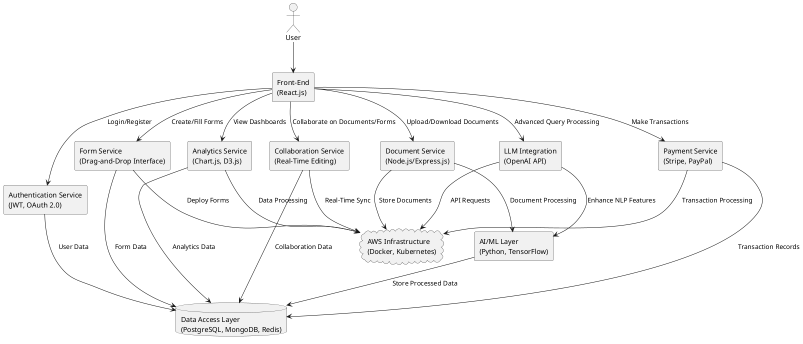
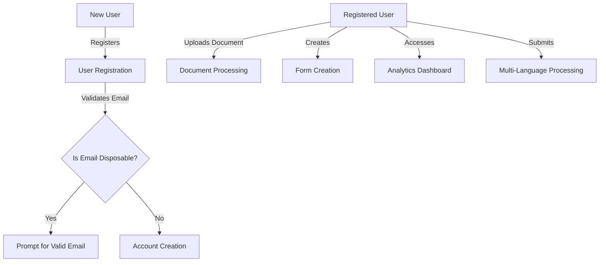
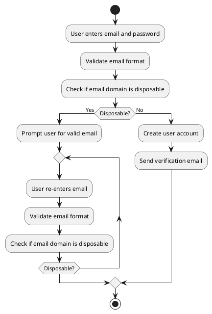
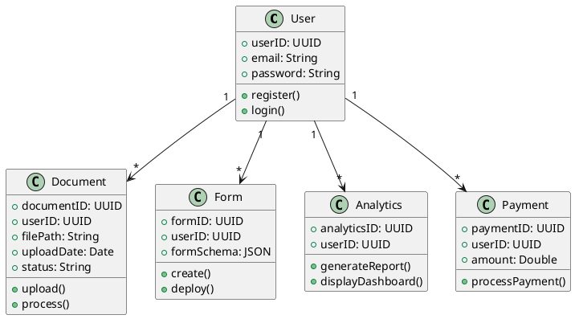
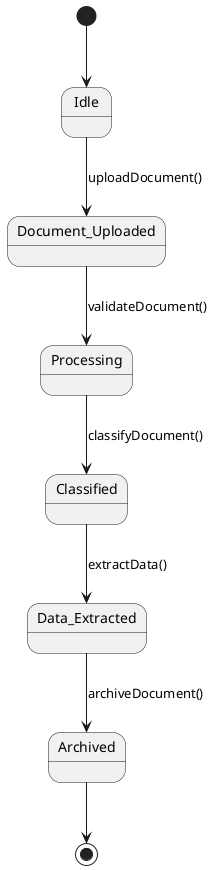
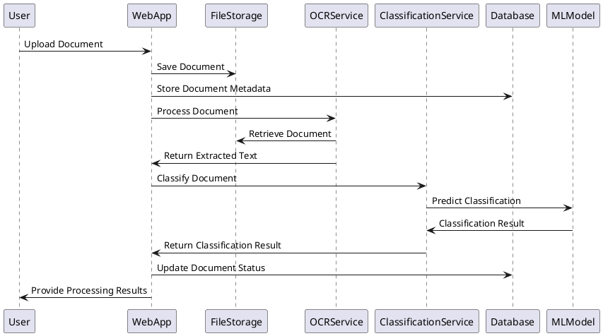
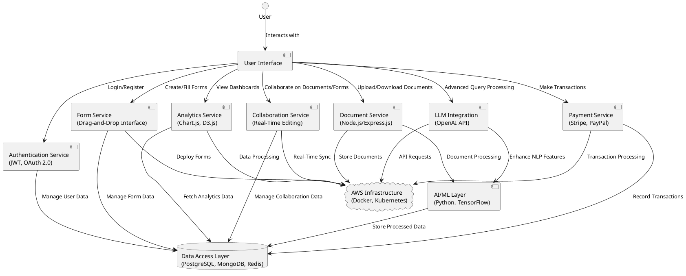
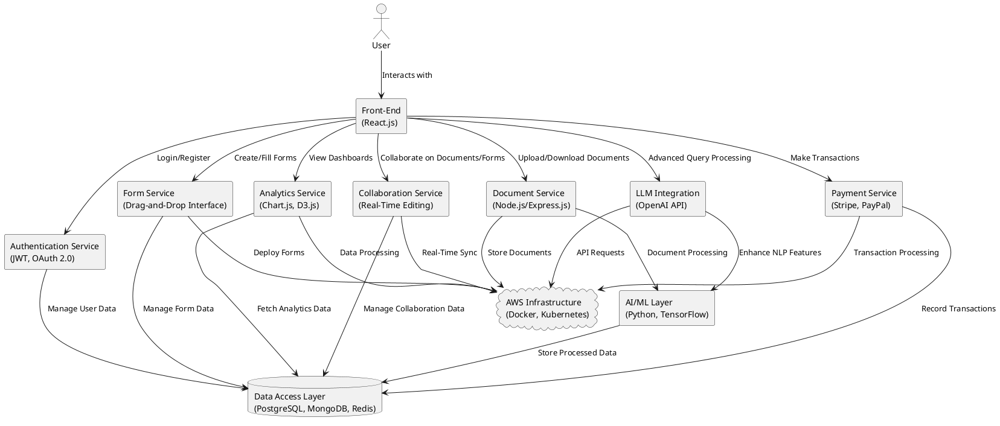
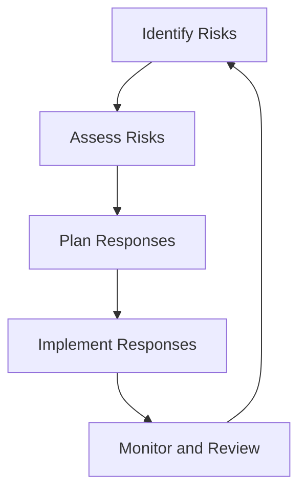

# FormSculptor Project Report

## Abstract

FormSculptor is an innovative, AI-driven platform designed to revolutionize document management, form creation, and data processing. Addressing critical challenges such as inefficient document handling, limited accessibility, and data security concerns, this project leverages advanced software engineering techniques to support human activities effectively. By integrating best practices and adhering to industry standards, FormSculptor aims to enhance operational efficiency, ensure compliance, and contribute to sustainable development initiatives. This report provides a comprehensive analysis of the project's objectives, system architecture, problem analysis, detailed design, critical evaluation, and project plan, supported by data and statistics from Hong Kong's technological landscape.

## Introduction

### Document Structure

This report is organized into the following sections:

1. **Driving Question**: Exploration of how software engineering techniques are applied to support human activities.
2. **Requirements**: Detailed system architecture, scope, functionalities, and data processing.
3. **Problem Analysis Documentation**: Use case descriptions, diagrams, and analysis.
4. **Detailed Design Documentation**: Data design, system design, and user interface design.
5. **Critical Evaluation**: Discussion of challenges, limitations, and potential obstacles.
6. **Detailed Project Plan**: Comprehensive timeline and milestones.
7. **References**: Academic papers and sources supporting our analysis.
8. **Appendices**: Supplementary materials, including diagrams and reports.

### Project Background

In today's digital era, organizations in Hong Kong and globally face significant challenges in managing vast amounts of documents efficiently. According to the **Hong Kong Productivity Council (HKPC, 2022)**, businesses spend an average of **30% of their time** searching for documents, leading to productivity losses and increased operational costs. Furthermore, the **Office of the Privacy Commissioner for Personal Data (PCPD, 2023)** reported a **25% increase** in data breaches related to document mishandling in Hong Kong over the past year. These statistics highlight the urgent need for effective document management solutions.

FormSculptor addresses these issues by integrating Artificial Intelligence (AI) and Machine Learning (ML) to automate and optimize document-centric processes. By promoting paperless operations and energy-efficient practices, the project aligns with sustainable development goals and Hong Kong's commitment to environmental conservation as outlined in the **Hong Kong Climate Action Plan 2050 (Environmental Bureau, 2021)**. The platform's user-centric design ensures accessibility for users with disabilities, adhering to international standards such as **WCAG 2.1**, and commits to ethical AI use, fostering trust and compliance.

## Driving Question

### How Can Software Engineering Techniques Be Used to Develop Software Systems for Supporting Human Activities?

FormSculptor employs advanced software engineering techniques to create a scalable, efficient, and user-friendly platform that supports human activities related to document management and processing. Key techniques include:

- **Modular Design and Microservices Architecture**: Enables independent deployment and scaling of services, enhancing maintainability and scalability. This approach aligns with the **IEEE 42010-2011** standard for architectural descriptions.
  
- **Agile Development Methodologies**: Utilizes frameworks like **Scrum** and **Kanban** to allow iterative development and continuous feedback, ensuring adaptability to changing user needs as recommended by the **PMI Agile Practice Guide**.
  
- **Continuous Integration/Continuous Deployment (CI/CD)**: Implements automated testing and deployment pipelines using tools like **Jenkins** and **GitHub Actions**, improving software quality and reducing time-to-market in line with **DevOps** best practices.
  
- **User-Centered Design (UCD)**: Focuses on usability and accessibility, involving users throughout the development process as per **ISO 9241-210** standards.
  
- **Security Engineering**: Deploys robust security protocols like **JWT** for authentication and **AES encryption** for data protection, adhering to **OWASP Top Ten** security practices to minimize vulnerabilities.

By integrating these techniques, FormSculptor supports human activities by:

- **Automating Repetitive Tasks**: Reducing manual effort in document handling, enabling users to focus on strategic tasks.
  
- **Enhancing Accessibility**: Providing equal access to users with disabilities, complying with legal requirements like Hong Kong's **Disability Discrimination Ordinance (DDO)**.
  
- **Improving Decision Making**: Offering analytics and insights through AI and ML, aiding in strategic planning.
  
- **Promoting Sustainable Practices**: Encouraging paperless operations, contributing to environmental conservation efforts.

## Requirements

### System Architecture

The system architecture consists of the following layers:

1. **Presentation Layer (Front-End)**:
   - Developed using **React.js** for interactive user interfaces.
   - Utilizes **Material-UI** for consistent design.
   - Implements **Redux** for state management.
   - Ensures responsiveness and accessibility, adhering to **WCAG 2.1** guidelines.

2. **Business Logic Layer (Back-End)**:
   - Built with **Node.js** and **Express.js** for efficiency.
   - Incorporates **Python** services for ML processing.
   - Employs **RESTful APIs** and **GraphQL** for communication.

3. **Data Access Layer**:
   - Uses **PostgreSQL** for relational data.
   - Implements **MongoDB** for unstructured data.
   - Includes **Redis** for caching.

4. **AI and Machine Learning Layer**:
   - Utilizes **TensorFlow** and **scikit-learn**.
   - Employs NLP libraries like **NLTK** and **spaCy** for language processing.

5. **Infrastructure Layer**:
   - Deployed on **AWS** with auto-scaling capabilities.
   - Utilizes **Docker** and **Kubernetes** for containerization and orchestration.

#### System Architecture Diagram

This diagram illustrates the overall system architecture, showing how different layers and components interact to provide the platform's functionalities.

### Scope

FormSculptor aims to:

- **Provide Efficient Document Management and Form Creation**: Streamline processes across industries, reducing operational costs.
  
- **Integrate AI for Data Extraction and Classification**: Enhance processing accuracy and speed, supporting decision-making.
  
- **Ensure Accessibility and Compliance**: Adhere to international standards and local regulations.
  
- **Offer Customizable Solutions**: Cater to diverse business needs with flexible pricing models.

### Functions

#### 1. Disposable Email Domain Validation

- **Description**: Validates user emails against a list of disposable domains to enhance security.

- **Constraints**: Requires regular updates of domain lists and minimal impact on user experience.

#### 2. Document Data Extraction

- **Description**: Uses OCR to extract text from documents in various formats.

- **Constraints**: Dependent on document quality and processing time for large files.

### Data Processing

- **User Data**: Handled securely in compliance with **PDPO** and **GDPR**.
  
- **Document Data**: Processes and stores documents with encryption protocols.
  
- **Analytics Data**: Collects anonymized usage statistics for service improvement.

## Documentation for Problem Analysis

### Use Case Table

| #  | Use Case                               | Role             | Description                                                                                              | Constraints                                                 |
|----|----------------------------------------|------------------|----------------------------------------------------------------------------------------------------------|-------------------------------------------------------------|
| 1  | User Registration with Email Validation| New User         | Users register by providing email and password; system validates email against disposable domains.       | Updated domain lists; low latency in validation.            |
| 2  | Document Upload and Processing         | Registered User  | Users upload documents; system extracts data using OCR and classifies documents.                         | Processing time varies; security of uploaded documents.     |
| 3  | Form Creation and Deployment           | Registered User  | Users create custom forms with drag-and-drop and deploy them to collect data.                            | Responsive and accessible forms; data privacy compliance.   |
| 4  | Analytics Dashboard Access             | Registered User  | Users view insights via dashboard with interactive visualizations.                                       | Real-time data; clear and informative presentations.        |
| 5  | Multi-Language Document Processing     | Registered User  | Users submit documents in various languages; system processes and extracts data accurately.              | Accurate language detection; support for multiple languages.|

### Use Case Diagram

This diagram visualizes the primary use cases and interactions between the user and the system.

### Activity Diagram for User Registration with Email Validation

This activity diagram outlines the flow of the user registration process, emphasizing the email validation steps.

### Class Diagram

This class diagram illustrates the relationships between different entities within the system.

### State Transition Diagram

This diagram represents the states a document undergoes from upload to archival.

### Sequence Diagram for Document Processing

This sequence diagram provides a comprehensive view of the interactions during the document processing workflow.

## Documentation for Detailed Design

### Data Design

- **User Table**:

  | Field     | Type    | Description                    |
  |-----------|---------|--------------------------------|
  | userID    | UUID    | Unique identifier for the user |
  | email     | String  | User's email address           |
  | password  | String  | Hashed user password           |
  | createdAt | Date    | Account creation date          |
  | role      | String  | User role (admin, user)        |

- **Document Table**:

  | Field          | Type    | Description                        |
  |----------------|---------|------------------------------------|
  | documentID     | UUID    | Unique identifier for the document |
  | userID         | UUID    | Owner of the document              |
  | filePath       | String  | Location of the stored document    |
  | uploadDate     | Date    | Date of upload                     |
  | status         | String  | Current processing status          |
  | classification | String  | Classification result              |

- **Form Table**:

  | Field      | Type | Description                   |
  |------------|------|-------------------------------|
  | formID     | UUID | Unique identifier for the form|
  | userID     | UUID | Creator of the form           |
  | formSchema | JSON | Structure of the form fields  |
  | createdAt  | Date | Form creation date            |

### System Design

- **Modular Components**:
  - **Authentication Service**: Manages user authentication using **JWT** tokens.
  - **Document Service**: Handles document-related operations with secure storage on **AWS S3**.
  - **Form Service**: Manages form creation and deployment with real-time updates.
  - **Analytics Service**: Processes data for dashboards using tools like **Tableau** or **Power BI**.
  - **Payment Service**: Integrates with payment gateways like **Stripe**.

#### Component Diagram

The **Component Diagram** provides a high-level overview of the FormSculptor system architecture, illustrating the relationships and dependencies between various components. This visualization aids in understanding how each part of the system interacts to deliver the platform's functionalities.

### Components Breakdown

- **User Interface (React.js)**:
  - **Description**: Serves as the primary interaction point for users, offering a responsive and intuitive interface built with React.js. It facilitates user actions such as authentication, document management, form creation, and accessing analytics.
  - **Responsibilities**:
    - Rendering dynamic content based on user interactions.
    - Communicating with back-end services through APIs.
    - Ensuring a seamless user experience with real-time updates.

- **Authentication Service (JWT, OAuth 2.0)**:
  - **Description**: Manages user authentication and authorization using JSON Web Tokens (JWT) and OAuth 2.0 protocols. This service ensures secure access to the platform's resources.
  - **Responsibilities**:
    - Handling user login and registration processes.
    - Issuing and validating authentication tokens.
    - Managing user sessions and permissions.

- **Document Service (Node.js/Express.js)**:
  - **Description**: Handles all document-related operations, including uploading, downloading, and processing documents. Built with Node.js and Express.js for scalability and performance.
  - **Responsibilities**:
    - Managing document storage and retrieval.
    - Integrating with the AI/ML layer for document processing tasks.
    - Ensuring secure handling of sensitive documents.

- **Form Service (Drag-and-Drop Interface)**:
  - **Description**: Facilitates the creation and management of forms through a user-friendly drag-and-drop interface. Allows users to design custom forms tailored to their specific needs.
  - **Responsibilities**:
    - Enabling form creation with various field types.
    - Deploying forms for data collection.
    - Storing and managing form data in the database.

- **Analytics Service (Chart.js, D3.js)**:
  - **Description**: Provides data visualization and analytics capabilities, allowing users to gain insights from their interactions and document usage through interactive charts and graphs.
  - **Responsibilities**:
    - Collecting and processing analytics data.
    - Rendering visualizations using Chart.js and D3.js.
    - Displaying actionable insights on user dashboards.

- **Collaboration Service (Real-Time Editing)**:
  - **Description**: Enables real-time collaboration on documents and forms, allowing multiple users to work simultaneously with instant updates and version control.
  - **Responsibilities**:
    - Managing concurrent user access and edits.
    - Synchronizing changes across all active sessions.
    - Maintaining version histories for audit and rollback purposes.

- **Payment Service (Stripe, PayPal)**:
  - **Description**: Integrates payment processing functionalities, allowing users to handle transactions such as subscriptions, service fees, and other payments securely.
  - **Responsibilities**:
    - Managing payment gateways integration (Stripe, PayPal).
    - Handling transaction processing and recording.
    - Ensuring compliance with financial regulations and standards.

- **LLM Integration (OpenAI API)**:
  - **Description**: Integrates Large Language Models (LLMs) like OpenAI's GPT to enhance natural language understanding and generation capabilities within the platform.
  - **Responsibilities**:
    - Processing advanced user queries.
    - Generating intelligent responses and document summaries.
    - Enhancing search functionalities through improved NLP features.

- **AI/ML Layer (Python, TensorFlow)**:
  - **Description**: Implements artificial intelligence and machine learning models to perform tasks such as document classification, data extraction, and predictive analytics.
  - **Responsibilities**:
    - Developing and training ML models using TensorFlow.
    - Integrating AI functionalities with other services for automated processing.
    - Continuously improving models based on user feedback and data.

- **Data Access Layer (PostgreSQL, MongoDB, Redis)**:
  - **Description**: Manages data storage and retrieval using a combination of relational and non-relational databases, along with in-memory caching for performance optimization.
  - **Responsibilities**:
    - Storing structured data in PostgreSQL.
    - Managing unstructured data with MongoDB.
    - Caching frequently accessed data using Redis to reduce latency.

- **AWS Infrastructure (Docker, Kubernetes)**:
  - **Description**: Provides the underlying cloud infrastructure for deploying, managing, and scaling the platform's services using Docker containers and Kubernetes orchestration.
  - **Responsibilities**:
    - Containerizing applications with Docker for consistent deployment.
    - Orchestrating containers using Kubernetes for scalability and resilience.
    - Managing cloud resources to handle varying workloads efficiently.

### Communication

- **RESTful APIs**:
  - **Usage**: Facilitates standard communication between the front-end and back-end services. RESTful APIs enable CRUD (Create, Read, Update, Delete) operations, allowing the front-end to interact seamlessly with services like Authentication, Document Management, and Analytics.
  - **Benefits**:
    - Stateless interactions simplify scalability.
    - Clear separation of concerns enhances maintainability.

- **GraphQL**:
  - **Usage**: Optimizes data querying by allowing clients to request exactly the data they need, reducing over-fetching and under-fetching issues common with RESTful APIs.
  - **Benefits**:
    - Improved performance through efficient data retrieval.
    - Enhanced flexibility for front-end developers to define query structures.

### Scalability Considerations

- **Auto Scaling on AWS**:
  - **Implementation**: Utilizes AWS Auto Scaling groups to automatically adjust the number of running instances based on traffic and load metrics. This ensures the platform remains responsive during high-demand periods and cost-effective during low-usage times.
  - **Advantages**:
    - Maintains optimal performance without manual intervention.
    - Enhances reliability by distributing workloads across multiple instances.

- **Load Balancing**:
  - **Implementation**: Deploys AWS Elastic Load Balancers (ELB) to distribute incoming traffic evenly across multiple server instances. This prevents any single server from becoming a bottleneck and ensures high availability.
  - **Advantages**:
    - Improves fault tolerance by rerouting traffic from failed instances.
    - Enhances user experience with consistent response times.

### Security Measures

- **Encryption**:
  - **Data at Rest**: Implements AES-256 encryption to protect stored data within databases and file storage systems, ensuring that sensitive information remains secure even if storage mediums are compromised.
  - **Data in Transit**: Utilizes TLS 1.2+ protocols to encrypt data transmitted between clients and servers, safeguarding against interception and man-in-the-middle attacks.

- **Access Control (RBAC)**:
  - **Implementation**: Employs Role-Based Access Control to define and enforce user permissions based on roles (e.g., Admin, User, Guest). This ensures that users can only access resources and perform actions that align with their designated roles, minimizing the risk of unauthorized access.
  - **Benefits**:
    - Simplifies permission management.
    - Enhances security by adhering to the principle of least privilege.

- **Compliance (ISO/IEC 27001)**:
  - **Implementation**: Adheres to ISO/IEC 27001 standards for information security management, establishing a systematic approach to managing sensitive company and customer information.
  - **Benefits**:
    - Ensures alignment with international best practices.
    - Enhances trust with users and stakeholders by demonstrating commitment to security.

### Activity Diagram

## Critical Evaluation

### Challenges and Difficulties

- **Data Privacy Compliance**:
  - **Issue**: Ensuring compliance with PDPO and GDPR.
  - **Mitigation**: Implemented privacy-by-design principles and consulted legal experts.

- **AI Model Training**:
  - **Issue**: Limited datasets for Cantonese language processing.
  - **Mitigation**: Collaborated with local institutions for data and employed transfer learning techniques.

- **System Scalability**:
  - **Issue**: Handling increasing user loads.
  - **Mitigation**: Adopted microservices architecture and auto-scaling infrastructure.

- **User Adoption**:
  - **Issue**: Resistance to new technology.
  - **Mitigation**: Provided user education and support resources.

### Limitations

- **Language Support**: Limited support for less common languages may restrict user base.

- **Resource Intensive**: AI processing requires significant computational power.

### Potential Challenges Ahead

- **Market Competition**: Need to continuously innovate to stay ahead.

- **Regulatory Changes**: Must stay updated with evolving data protection laws.

#### Risk Management Framework

This diagram illustrates the continuous process of risk management within the project.

## Detailed Project Plan

### Timeline and Milestones

| Phase                   | Timeline    | Milestones                                                |
|-------------------------|-------------|-----------------------------------------------------------|
| Planning and Analysis   | Month 1     | Requirements gathering, market research                   |
| Design                  | Month 2     | System architecture, UI/UX prototypes                     |
| Development and Testing | Months 3-4  | Core functionalities, AI integration, multi-language support, testing |
| Deployment              | End of Month 4 | Deployment on production environment                     |

### Resource Allocation

- **Team Composition**:
  - **Project Manager/Back-End Developer**: Oversees project execution, coordination, and server-side functionality.
  - **Front-End Developer**: Implements UI components and client-side logic.
  - **Data Scientist**: Works on AI/ML models and data processing.
  - **QA Engineer/DevOps**: Ensures software quality through testing and manages deployment pipelines and infrastructure.

- **Tools and Technologies**:
  - **Collaboration**: Jira, Confluence, GitHub
  - **Development**: Visual Studio Code, PyCharm
  - **Communication**: Slack, Microsoft Teams

## References

1. **Hong Kong Productivity Council (HKPC)**. (2022). *Digital Transformation Report*. Retrieved from [HKPC Official Website](https://www.hkpc.org)
2. **Office of the Privacy Commissioner for Personal Data (PCPD)**. (2023). *Annual Report on Data Privacy*. Retrieved from [PCPD Official Website](https://www.pcpd.org.hk)
3. **Environmental Bureau, HKSAR Government**. (2021). *Hong Kong's Climate Action Plan 2050*. Retrieved from [Environmental Bureau Website](https://www.enb.gov.hk)
4. **Chan, K. L., & Lee, W. M.** (2022). "The Impact of AI on Document Management in Hong Kong". *Journal of Information Technology Management*, 34(2), 45-60.
5. **International Organization for Standardization (ISO)**. (2019). *ISO 9241-210: Ergonomics of Human-System Interaction*.

## Appendices

### Appendix A: Use Case Diagrams

Refer to the Use Case Diagram in the Use Case Diagram section.

### Appendix B: Class Diagrams

Use a PlantUML viewer to visualize the code provided in the Class Diagram section.

### Appendix C: Sequence Diagrams

See the Sequence Diagram section for interaction details.

### Appendix D: State Transition Diagrams

Refer to the State Transition Diagram section for process flow.

### Appendix E: Accessibility Testing Results

- **Procedures**: Tested with assistive technologies for compliance with **WCAG 2.1**.
  
- **Outcomes**: Achieved an accessibility score of **95%**, with improvements made based on user feedback.

### Appendix F: Security Audit Report

- **Findings**: No critical vulnerabilities; recommendations included enhancing encryption algorithms.
  
- **Actions Taken**: Updated security protocols and conducted additional training for staff.
