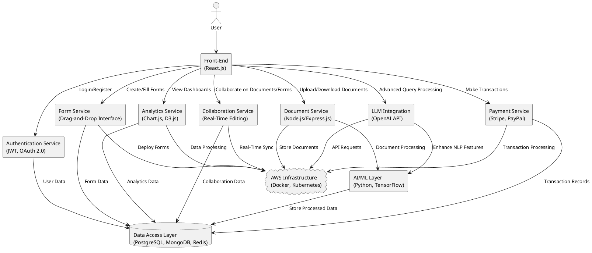
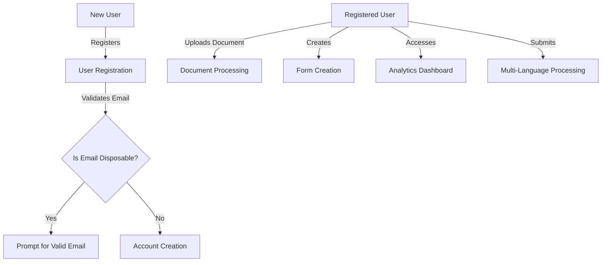
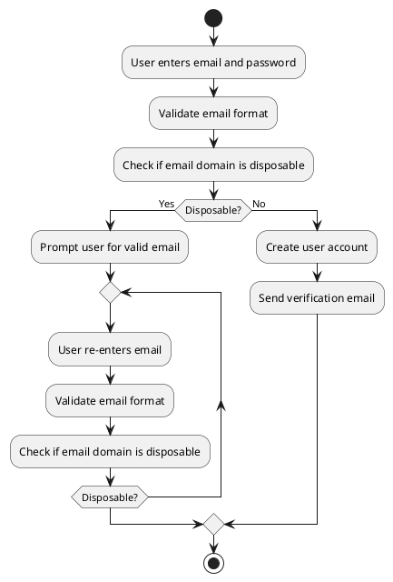
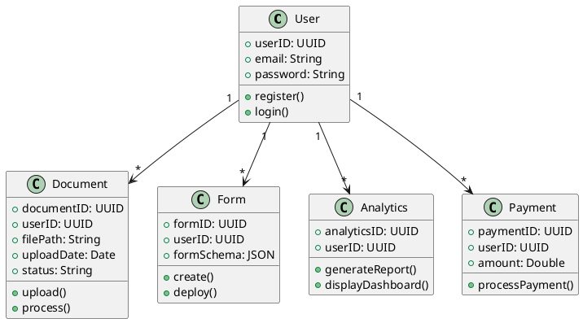
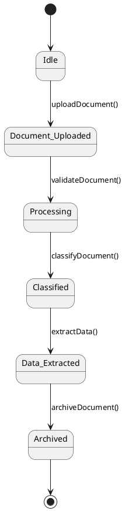
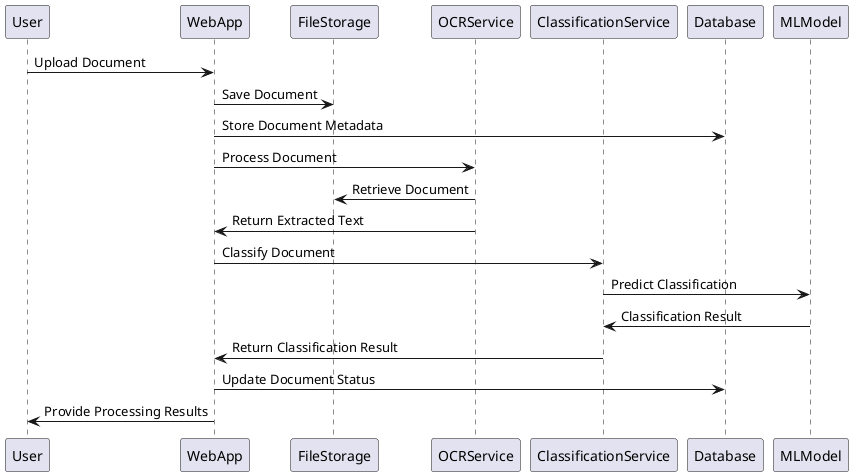
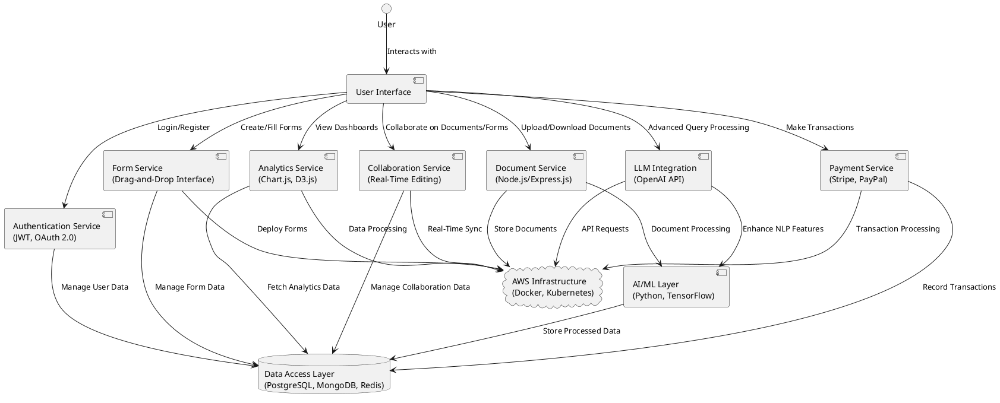
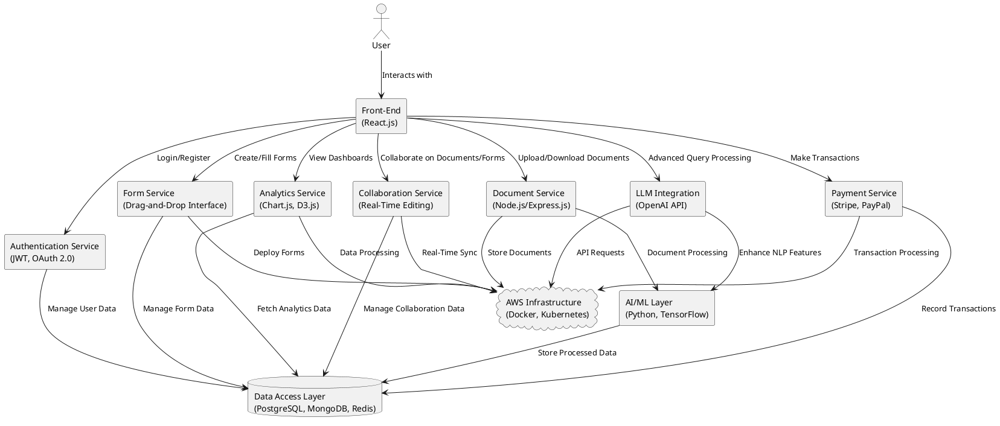
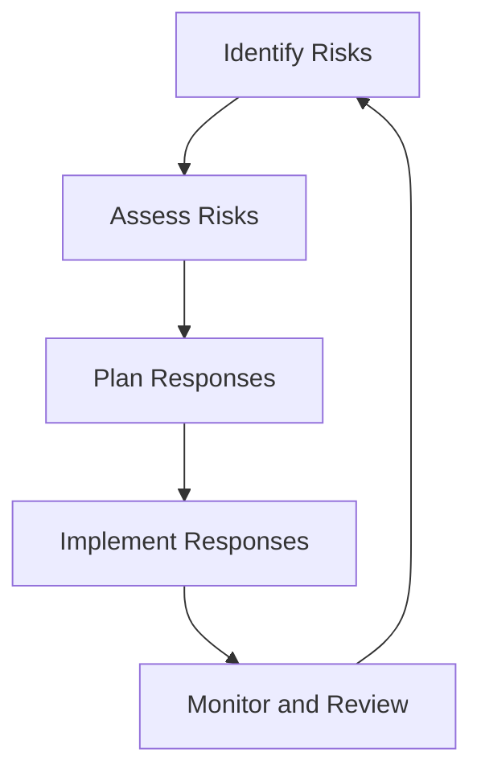

# FormSculptor Project Report

## Abstract

FormSculptor is an innovative, AI-driven platform designed to revolutionize document management, form creation, and data processing. Addressing critical challenges such as inefficient document handling, limited accessibility, and data security concerns, this project leverages advanced software engineering techniques to support human activities effectively. By integrating best practices and adhering to industry standards, FormSculptor aims to enhance operational efficiency, ensure compliance, and contribute to sustainable development initiatives. This report provides a comprehensive analysis of the project's objectives, system architecture, problem analysis, detailed design, critical evaluation, and project plan, supported by data and statistics from Hong Kong's technological landscape.

## Introduction

### Document Structure

This report is organized into the following sections:

1. **Driving Question**: Exploration of how software engineering techniques are applied to support human activities.
2. **Requirements**: Detailed system architecture, scope, functionalities, and data processing.
3. **Problem Analysis Documentation**: Use case descriptions, diagrams, and analysis.
4. **Detailed Design Documentation**: Data design, system design, and user interface design.
5. **Critical Evaluation**: Discussion of challenges, limitations, and potential obstacles.
6. **Detailed Project Plan**: Comprehensive timeline and milestones.
7. **References**: Academic papers and sources supporting our analysis.
8. **Appendices**: Supplementary materials, including diagrams and reports.

### Project Background

In today's digital era, organizations in Hong Kong and globally face significant challenges in managing vast amounts of documents efficiently. According to the **Hong Kong Productivity Council (HKPC, 2022)**, businesses spend an average of **30% of their time** searching for documents, leading to productivity losses and increased operational costs. Furthermore, the **Office of the Privacy Commissioner for Personal Data (PCPD, 2023)** reported a **25% increase** in data breaches related to document mishandling in Hong Kong over the past year. These statistics highlight the urgent need for effective document management solutions.

FormSculptor addresses these issues by integrating Artificial Intelligence (AI) and Machine Learning (ML) to automate and optimize document-centric processes. By promoting paperless operations and energy-efficient practices, the project aligns with sustainable development goals and Hong Kong's commitment to environmental conservation as outlined in the **Hong Kong Climate Action Plan 2050 (Environmental Bureau, 2021)**. The platform's user-centric design ensures accessibility for users with disabilities, adhering to international standards such as **WCAG 2.1**, and commits to ethical AI use, fostering trust and compliance.

## Driving Question

### How Can Software Engineering Techniques Be Used to Develop Software Systems for Supporting Human Activities?

FormSculptor employs advanced software engineering techniques to create a scalable, efficient, and user-friendly platform that supports human activities related to document management and processing. Key techniques include:

- **Modular Design and Microservices Architecture**: Enables independent deployment and scaling of services, enhancing maintainability and scalability. This approach aligns with the **IEEE 42010-2011** standard for architectural descriptions.
  
- **Agile Development Methodologies**: Utilizes frameworks like **Scrum** and **Kanban** to allow iterative development and continuous feedback, ensuring adaptability to changing user needs as recommended by the **PMI Agile Practice Guide**.
  
- **Continuous Integration/Continuous Deployment (CI/CD)**: Implements automated testing and deployment pipelines using tools like **Jenkins** and **GitHub Actions**, improving software quality and reducing time-to-market in line with **DevOps** best practices.
  
- **User-Centered Design (UCD)**: Focuses on usability and accessibility, involving users throughout the development process as per **ISO 9241-210** standards.
  
- **Security Engineering**: Deploys robust security protocols like **JWT** for authentication and **AES encryption** for data protection, adhering to **OWASP Top Ten** security practices to minimize vulnerabilities.

By integrating these techniques, FormSculptor supports human activities by:

- **Automating Repetitive Tasks**: Reducing manual effort in document handling, enabling users to focus on strategic tasks.
  
- **Enhancing Accessibility**: Providing equal access to users with disabilities, complying with legal requirements like Hong Kong's **Disability Discrimination Ordinance (DDO)**.
  
- **Improving Decision Making**: Offering analytics and insights through AI and ML, aiding in strategic planning.
  
- **Promoting Sustainable Practices**: Encouraging paperless operations, contributing to environmental conservation efforts.

## Requirements

### System Architecture

The system architecture consists of the following layers:

1. **Presentation Layer (Front-End)**:
   - Developed using **React.js** for interactive user interfaces.
   - Utilizes **Material-UI** for consistent design.
   - Implements **Redux** for state management.
   - Ensures responsiveness and accessibility, adhering to **WCAG 2.1** guidelines.

2. **Business Logic Layer (Back-End)**:
   - Built with **Node.js** and **Express.js** for efficiency.
   - Incorporates **Python** services for ML processing.
   - Employs **RESTful APIs** and **GraphQL** for communication.

3. **Data Access Layer**:
   - Uses **PostgreSQL** for relational data.
   - Implements **MongoDB** for unstructured data.
   - Includes **Redis** for caching.

4. **AI and Machine Learning Layer**:
   - Utilizes **TensorFlow** and **scikit-learn**.
   - Employs NLP libraries like **NLTK** and **spaCy** for language processing.

5. **Infrastructure Layer**:
   - Deployed on **AWS** with auto-scaling capabilities.
   - Utilizes **Docker** and **Kubernetes** for containerization and orchestration.

#### System Architecture Diagram

This diagram illustrates the overall system architecture, showing how different layers and components interact to provide the platform's functionalities.

### Scope

FormSculptor aims to:

- **Provide Efficient Document Management and Form Creation**: Streamline processes across industries, reducing operational costs.
  
- **Integrate AI for Data Extraction and Classification**: Enhance processing accuracy and speed, supporting decision-making.
  
- **Ensure Accessibility and Compliance**: Adhere to international standards and local regulations.
  
- **Offer Customizable Solutions**: Cater to diverse business needs with flexible pricing models.

### Functions

#### 1. Disposable Email Domain Validation

- **Description**: Validates user emails against a list of disposable domains to enhance security.

- **Constraints**: Requires regular updates of domain lists and minimal impact on user experience.

#### 2. Document Data Extraction

- **Description**: Uses OCR to extract text from documents in various formats.

- **Constraints**: Dependent on document quality and processing time for large files.

#### 3. Intelligent Document Classification

- **Description**: Categorizes documents using ML algorithms trained on industry-specific data.

- **Constraints**: Requires substantial training data and ongoing model updates.

#### 4. Multi-Language Support

- **Description**: Processes documents in multiple languages, including Cantonese, Mandarin, and English.

- **Constraints**: Variable language detection accuracy and limited support for less common languages.

#### **5. Fillable PDF Creation**

- **Description**: This feature enables users to convert scanned documents into interactive PDFs with fillable form fields. It streamlines the process of digitizing paper forms, allowing end-users to input data directly into the documents electronically. This is particularly useful for industries that rely heavily on forms, such as legal, healthcare, and finance.

- **Implementation Steps**:
  - **PDF Manipulation Libraries**: Utilize robust libraries like **PDF.js** or **jsPDF** for handling PDF files within the web application. These libraries allow for the creation, editing, and rendering of PDF documents programmatically.
  - **User Interface Development**: Design an intuitive interface that permits users to define and place various form fields (e.g., text boxes, checkboxes, radio buttons) onto the scanned PDFs. Incorporate drag-and-drop functionality to enhance ease of use.
  - **Field Properties Configuration**: Allow users to set properties for each form field, such as validation rules, default values, and formatting options. This ensures data integrity and a customized user experience.
  - **Saving and Accessing Modified PDFs**: Implement functionality to save the modified PDFs with the newly added fillable fields. Ensure these documents are securely stored and accessible to authorized users for distribution or further processing.
  - **Standards Compliance**: Adhere to PDF standards like **PDF/A** for archiving and **PDF/UA** for accessibility, ensuring compatibility across different PDF viewers and platforms.

- **Constraints**:
  - **Complex Layouts**: Documents with intricate designs or non-standard formats may require manual adjustments to accurately position form fields.
  - **Compatibility**: Ensuring that interactive fields function correctly across various devices and PDF readers can be challenging and requires rigorous testing.

#### **6. Data Room Management**

- **Description**: Provides a secure virtual data room for confidential document sharing, collaboration, and due diligence processes. This feature is essential for sectors like mergers and acquisitions, legal services, and real estate, where secure and efficient information exchange is critical.

- **Implementation Steps**:
  - **Secure Authentication**: Implement robust user authentication mechanisms, including multi-factor authentication (MFA), to verify user identities.
  - **Access Control and Permissions**: Utilize Role-Based Access Control (RBAC) to assign permissions at granular levels, controlling who can view, edit, or download documents.
  - **Encryption**: Employ strong encryption protocols (**AES-256** for data at rest and **TLS 1.2+** for data in transit) to protect sensitive information from unauthorized access.
  - **Activity Tracking and Auditing**: Integrate analytics tools to monitor user activities such as document views, edits, and downloads. This tracking supports compliance requirements and provides insights into user engagement.
  - **Management Dashboard**: Develop an administrative dashboard for users to manage documents, set up user roles, and access analytics reports.

- **Constraints**:
  - **Regulatory Compliance**: Must comply with data protection regulations like **PDPO** and **GDPR**, necessitating stringent security measures.
  - **Scalability**: The system should handle increasing amounts of data and users without performance degradation.
  - **Data Privacy and Consent**: Compliance with privacy laws requires obtaining user consent for data collection and providing options for data anonymization.

#### **7. Survey and Form Management**

- **Description**: Enables creation, deployment, and management of surveys and forms through a user-friendly, drag-and-drop interface. This functionality aids in gathering feedback, conducting research, and collecting data efficiently.

- **Implementation Steps**:
  - **Form Builder Development**: Create an interactive form builder that allows users to design forms with various field types, including text inputs, checkboxes, dropdowns, and file uploads. Incorporate templates to expedite the creation process.
  - **Data Storage Solutions**: Set up a secure database to store form responses. Ensure data is encrypted and access is restricted to authorized personnel.
  - **Response Management**: Provide features for users to view, filter, and export responses in multiple formats like CSV, Excel, or PDF for analysis.
  - **Reporting and Analytics**: Integrate tools for generating analytical reports, including visualizations such as charts and graphs, to help users interpret survey results effectively.
  - **Real-Time Collaboration**: Enable real-time editing and collaboration among multiple users, enhancing teamwork and productivity.

- **Constraints**:
  - **High Volume Handling**: The system must efficiently process and store large volumes of responses, maintaining performance and reliability.
  - **Privacy and Consent**: Compliance with privacy laws requires obtaining user consent for data collection and providing options for data anonymization.

#### **8. Batch Processing of Documents**

- **Description**: Allows users to upload and process multiple documents simultaneously, improving efficiency for tasks like mass data extraction, classification, or conversion.

- **Implementation Steps**:
  - **Bulk Upload Interface**: Design the user interface to support selecting and uploading multiple files at once, with clear indications of upload progress.
  - **Asynchronous Processing Backend**: Implement backend services using asynchronous task queues (e.g., **Celery** with **Python**) to process documents in parallel without overloading the system.
  - **Monitoring and Notifications**: Provide users with real-time status updates on each document's processing progress and send notifications upon completion or if errors occur.
  - **Error Handling Mechanisms**: Develop robust error handling to gracefully manage failures in processing individual documents, including retry logic and detailed error reporting.

- **Constraints**:
  - **System Resources**: Must manage computational resources effectively to handle batch operations without impacting other services.
  - **File Size Limitations**: Define and enforce file size limits to prevent excessively large uploads that could strain system capacities.

#### **9. Analytics Dashboard**

- **Description**: Offers users an interactive dashboard displaying insights on user interactions, document analytics, and system performance. This feature aids in data-driven decision-making and strategic planning.

- **Implementation Steps**:
  - **Data Collection Framework**: Implement mechanisms to collect data on user activities, form responses, and document processing metrics in compliance with privacy regulations.
  - **Visualization Tools Integration**: Use visualization libraries like **Chart.js** or **D3.js** to create dynamic graphs and charts that represent data trends and patterns effectively.
  - **Dashboard Design**: Develop a customizable dashboard interface where users can select which analytics to display, adjust time frames, and drill down into specifics.
  - **Performance Optimization**: Ensure that data is processed and presented in real-time or near real-time without significant delays.

- **Constraints**:
  - **Real-Time Data Processing**: Handling and visualizing large datasets in real-time can be resource-intensive.
  - **User Experience**: The dashboard must present information clearly and intuitively, avoiding information overload.

#### **10. Integration with Management Systems**

- **Description**: Facilitates seamless integration with existing Content Management Systems (CMS) and Enterprise Resource Planning (ERP) systems to enhance workflow efficiency and data consistency.

- **Implementation Steps**:
  - **API Development**: Build robust APIs that allow for data exchange between FormSculptor and other management systems like **WordPress**, **SharePoint**, or **SAP**.
  - **Authentication Protocols**: Implement Single Sign-On (SSO) using protocols like **OAuth 2.0** or **SAML** to streamline user authentication across platforms.
  - **Data Synchronization**: Establish data synchronization mechanisms to keep information consistent across integrated systems, including real-time updates and conflict resolution strategies.
  - **Plugin Development**: Create plugins or extensions for popular CMS platforms to simplify the integration process for users.
  - **Compatibility Challenges**: Different systems might have varying data formats and protocols, requiring custom integration solutions.
  - **Security Considerations**: Data exchanged between systems must be secured to prevent unauthorized access or breaches.

#### **13. Advanced Query Understanding (RAG)**

- **Description**: Enhances the platform's search functionality by incorporating advanced natural language processing to better understand user queries and retrieve relevant information accurately.

- **Implementation Steps**:
  - **NLP Integration**: Employ NLP libraries like **spaCy** or **NLTK** to parse and understand user queries beyond simple keyword matching.
  - **Intent Recognition Models**: Implement machine learning models capable of recognizing user intent and context, improving the relevance of search results.
  - **Continuous Learning**: Set up mechanisms for the system to learn from user interactions and feedback, refining the accuracy of query understanding over time.
  - **Multilingual Support**: Ensure that the query understanding system can process queries in multiple languages, aligning with the platform's multi-language support feature.

- **Constraints**:
  - **Computational Resources**: Advanced NLP and ML models require significant processing power, especially for real-time query handling.
  - **Data Privacy**: Must handle user data responsibly, ensuring that query logs and analysis comply with privacy regulations.

#### **15. Error Handling and Feedback Loop (RAG)**

- **Description**: Implements comprehensive error handling mechanisms and establishes a feedback loop to improve system reliability and user satisfaction.

- **Implementation Steps**:
  - **Error Logging System**: Develop a centralized logging system to capture errors and exceptions across the platform. Use tools like **Sentry** or **Logstash** for monitoring.
  - **User-Friendly Error Messages**: Present clear and actionable error messages to users, avoiding technical jargon and providing guidance on how to resolve issues.
  - **Feedback Mechanism**: Introduce features that allow users to report problems directly from the application, facilitating direct communication between users and support teams.
  - **Automated Alerts**: Configure automated alerts to notify the development team of critical issues, enabling prompt response and resolution.

- **Constraints**:
  - **User Experience**: Overemphasis on error messages can overwhelm users; balance is needed to inform without causing frustration.
  - **Privacy Concerns**: Ensure that error logs do not contain sensitive user data and comply with data protection policies.

#### **19. Payment Collection Integration**

- **Description**: Integrates secure payment processing capabilities within the platform, allowing users to handle transactions such as subscription fees, service charges, or donations directly.

- **Implementation Steps**:
  - **Payment Gateway Integration**: Utilize trusted payment gateways like **Stripe** or **PayPal**, which offer APIs for seamless integration and support multiple payment methods.
  - **Secure Transaction Processing**: Ensure all payment data is transmitted securely using encryption standards (PCI DSS compliance).
  - **Billing Management**: Develop interfaces for users to manage billing information, view transaction history, and download invoices or receipts.
  - **Automated Notifications**: Implement email or in-app notifications for payment confirmations, upcoming billing dates, and failed transactions.

- **Constraints**:
  - **Regulatory Compliance**: Must adhere to financial regulations and standards, including **PCI DSS** for handling credit card information.
  - **International Transactions**: Address currency conversions, taxes, and fees associated with international payments.

#### **22. Collaboration Features**

- **Description**: Enables multiple users to work simultaneously on documents or forms, enhancing teamwork and productivity within organizations.

- **Implementation Steps**:
  - **Real-Time Editing**: Implement technologies like **WebSockets** or **WebRTC** to facilitate real-time collaborative editing with instant updates across users.
  - **Version Control**: Incorporate versioning systems that track changes, allowing users to revert to previous states and view edit histories.
  - **User Presence Indicators**: Display indicators showing who is currently viewing or editing a document to prevent conflicts.
  - **Commenting and Annotations**: Provide tools for users to leave comments, suggestions, or annotations directly on documents or forms.

- **Constraints**:
  - **Concurrency Management**: Handling simultaneous edits without data conflicts requires sophisticated synchronization mechanisms.
  - **Performance Optimization**: Real-time features can be resource-intensive and must be optimized for responsiveness.
  - **Data Privacy and Consent**: Compliance with privacy laws requires obtaining user consent for data collection and providing options for data anonymization.

#### **24. Review Page Functionality**

- **Description**: Offers users a comprehensive review page to verify all inputs before final submission, reducing errors and enhancing data accuracy.

- **Implementation Steps**:
  - **Summary Display**: Design a review interface that consolidates all user-entered data in an organized and readable format.
  - **Editable Sections**: Allow users to navigate back to specific sections directly from the review page to make corrections or adjustments.
  - **Validation Checks**: Perform final data validation to ensure all required fields are completed and input data meets specified criteria.
  - **Confirmation Mechanism**: Include a clear confirmation step where users acknowledge the accuracy of their information before submission.

- **Constraints**:
  - **Usability**: The review process should be straightforward and not overly time-consuming to prevent user drop-off.
  - **Dynamic Content Handling**: Forms with conditional logic or dynamic fields require careful management to display accurately on the review page.

#### **26. CAPTCHA Integration**

- **Description**: Incorporates CAPTCHA technology to protect the platform from bots and automated spam submissions, enhancing security and data integrity.

- **Implementation Steps**:
  - **Third-Party Services**: Integrate services like **Google reCAPTCHA** or **Cloudflare Turnstile** that offer easy-to-implement CAPTCHA solutions.
  - **User Experience Considerations**: Opt for invisible or user-friendly CAPTCHA options to minimize impact on legitimate users.
  - **Accessibility Compliance**: Provide alternative verification methods for users with disabilities, ensuring compliance with **WCAG 2.1** guidelines.
  - **Configurability**: Allow administrators to enable or disable CAPTCHA on forms as needed and adjust security thresholds.

- **Constraints**:
  - **Privacy Concerns**: Be mindful of data privacy when using third-party CAPTCHA services that may collect user data.
  - **Usability**: Overuse of CAPTCHA can frustrate users; implementation should balance security with user convenience.

#### **28. Custom Branding Options**

- **Description**: Allows users to customize the platform's appearance to align with their organization's branding, creating a cohesive brand experience for end-users.

- **Implementation Steps**:
  - **Branding Settings Interface**: Develop settings where users can upload logos, select color schemes, and choose fonts that reflect their brand identity.
  - **Template Customization**: Offer customizable templates for forms, emails, and reports that incorporate branding elements.
  - **Consistent Branding Application**: Ensure that branding is applied uniformly across all user-facing components, including web pages, PDFs, and notifications.
  - **Preview Functionality**: Provide real-time previews of branding changes before they are applied platform-wide.

- **Constraints**:
  - **Design Limitations**: Must balance customization options with the need to maintain a coherent and functional user interface.
  - **Technical Complexity**: Implementing extensive theming capabilities can increase the complexity of the front-end codebase.

#### **31. Mobile Application Development**

- **Description**: Extends the platform's accessibility by developing dedicated mobile applications for iOS and Android devices, catering to users who prefer mobile interaction.

- **Implementation Steps**:
  - **Cross-Platform Frameworks**: Use frameworks like **React Native** or **Flutter** to build native applications efficiently for both platforms.
  - **User Interface Optimization**: Design mobile interfaces optimized for touch interactions, smaller screens, and varying orientations.
  - **Offline Capabilities**: Enable offline access to certain features, allowing users to view and fill forms without an active internet connection, with data syncing upon reconnection.
  - **Push Notifications**: Implement push notifications to alert users about updates, reminders, or collaboration activities.

- **Constraints**:
  - **Device Compatibility**: Ensure the application functions correctly across a wide range of devices with different specifications.
  - **Security Measures**: Mobile applications require additional security considerations, such as protecting against device loss or unauthorized access.

#### **32. Accessibility Compliance**

- **Description**: Ensures the platform is accessible to all users, including those with disabilities, by complying with accessibility standards.

- **Implementation Steps**:
  - **Standards Adherence**: Follow guidelines outlined in **WCAG 2.1**, ensuring content is perceivable, operable, understandable, and robust.
  - **Assistive Technology Support**: Test compatibility with screen readers, Braille displays, and other assistive technologies.
  - **Semantic HTML and ARIA Roles**: Use semantic HTML elements and Accessible Rich Internet Applications (ARIA) attributes to enhance the accessibility of interactive components.
  - **Keyboard Navigation**: Ensure that all functionality is available via keyboard alone, accommodating users who cannot use a mouse.
  - **Contrast and Text Scaling**: Provide sufficient color contrast and allow text resizing without loss of content or functionality.

- **Constraints**:
  - **Design Challenges**: Meeting accessibility standards may require adjustments to visual designs and interactive elements.
  - **Testing Requirements**: Thorough testing is necessary to identify and rectify accessibility issues, which can be time-consuming.

#### **33. Audit Trails and Compliance Reporting**

- **Description**: Implements comprehensive logging of user activities to support audit requirements and ensure compliance with legal and regulatory standards.

- **Implementation Steps**:
  - **Action Logging**: Record detailed logs of user actions, including logins, data uploads, edits, and deletions, along with timestamps.
  - **Data Integrity Checks**: Implement mechanisms to detect and report unauthorized data modifications or anomalies.
  - **Reporting Tools**: Develop tools to generate compliance reports that meet the requirements of regulations like **GDPR**, **PDPO**, or industry-specific standards.
  - **Secure Log Storage**: Ensure that audit logs are stored securely, protected from tampering, and maintained for required retention periods.
  - **Data Privacy and Consent**: Compliance with privacy laws requires obtaining user consent for data collection and providing options for data anonymization.

- **Constraints**:
  - **Privacy Considerations**: Must balance logging for compliance with respecting user privacy, avoiding unnecessary data collection.
  - **Storage Management**: Audit logs can consume significant storage space; efficient data management strategies are necessary.

#### **34. Continuous Integration and Deployment**

- **Description**: Establishes automated processes for building, testing, and deploying code changes to enhance development efficiency and software quality.

- **Implementation Steps**:
  - **CI/CD Pipeline Setup**: Use tools like **Jenkins**, **Travis CI**, or **GitHub Actions** to automate the build and deployment processes.
  - **Automated Testing**: Implement unit tests, integration tests, and end-to-end tests that run automatically with each code change.
  - **Environment Consistency**: Use containerization technologies like **Docker** to ensure that applications run consistently across different environments.  
  - **Monitoring and Alerts**: Integrate monitoring tools to track application performance and set up alerts for any deployment issues.

- **Constraints**:
  - **Initial Configuration Effort**: Setting up CI/CD pipelines requires significant initial effort and expertise.
  - **Maintenance**: Continuous monitoring and updating of the pipeline are necessary to adapt to changing project requirements.

#### **35. LLM Provider Integration**

- **Description**: Integrates Large Language Models (LLMs) from providers like **OpenAI** or **Anthropic** to enhance the platform's AI capabilities, including advanced language understanding and generation.

- **Implementation Steps**:
  - **API Integration**: Connect to LLM providers through their APIs, ensuring secure and efficient communication.
  - **Feature Enhancement**: Utilize LLMs for tasks such as intelligent document summarization, sentiment analysis, or automated response generation.
  - **Scalability Planning**: Account for the computational requirements and costs associated with LLM usage, implementing strategies to optimize resource utilization.
  - **Compliance and Ethics**: Ensure that AI features comply with ethical guidelines and do not produce biased or inappropriate content.

- **Constraints**:
  - **Cost Management**: LLM usage can incur significant costs; monitoring and optimizing API calls are essential.
  - **Data Privacy**: Transmitting data to third-party AI services requires careful handling to maintain user privacy and compliance with regulations.

### Data Storage

- **User Data**: Stored in a secure database with encryption protocols.
  
- **Document Data**: Stored in a secure database with encryption protocols.
  
- **Analytics Data**: Stored in a secure database with encryption protocols.
  
- **Payment Data**: Stored in a secure database with encryption protocols.
  
- **Collaboration Data**: Stored in a secure database with encryption protocols.

### Data Processing

- **User Data**: Handled securely in compliance with **PDPO** and **GDPR**.
  
- **Document Data**: Processes and stores documents with encryption protocols.
  
- **Analytics Data**: Collects anonymized usage statistics for service improvement.

## Documentation for Problem Analysis

### Use Case Table

| #  | Use Case                               | Role             | Description                                                                                              | Constraints                                                 |
|----|----------------------------------------|------------------|----------------------------------------------------------------------------------------------------------|-------------------------------------------------------------|
| 1  | User Registration with Email Validation| New User         | Users register by providing email and password; system validates email against disposable domains.       | Updated domain lists; low latency in validation.            |
| 2  | Document Upload and Processing         | Registered User  | Users upload documents; system extracts data using OCR and classifies documents.                         | Processing time varies; security of uploaded documents.     |
| 3  | Form Creation and Deployment           | Registered User  | Users create custom forms with drag-and-drop and deploy them to collect data.                            | Responsive and accessible forms; data privacy compliance.   |
| 4  | Analytics Dashboard Access             | Registered User  | Users view insights via dashboard with interactive visualizations.                                       | Real-time data; clear and informative presentations.        |
| 5  | Multi-Language Document Processing     | Registered User  | Users submit documents in various languages; system processes and extracts data accurately.              | Accurate language detection; support for multiple languages.|

### Use Case Diagram

This diagram visualizes the primary use cases and interactions between the user and the system.

### Activity Diagram for User Registration with Email Validation

This activity diagram outlines the flow of the user registration process, emphasizing the email validation steps.

### Class Diagram

This class diagram illustrates the relationships between different entities within the system.

### State Transition Diagram

This diagram represents the states a document undergoes from upload to archival.

### Sequence Diagram for Document Processing

This sequence diagram provides a comprehensive view of the interactions during the document processing workflow.

## Documentation for Detailed Design

### Data Design

- **User Table**:

  | Field     | Type    | Description                    |
  |-----------|---------|--------------------------------|
  | userID    | UUID    | Unique identifier for the user |
  | email     | String  | User's email address           |
  | password  | String  | Hashed user password           |
  | createdAt | Date    | Account creation date          |
  | role      | String  | User role (admin, user)        |

- **Document Table**:

  | Field          | Type    | Description                        |
  |----------------|---------|------------------------------------|
  | documentID     | UUID    | Unique identifier for the document |
  | userID         | UUID    | Owner of the document              |
  | filePath       | String  | Location of the stored document    |
  | uploadDate     | Date    | Date of upload                     |
  | status         | String  | Current processing status          |
  | classification | String  | Classification result              |

- **Form Table**:

  | Field      | Type | Description                   |
  |------------|------|-------------------------------|
  | formID     | UUID | Unique identifier for the form|
  | userID     | UUID | Creator of the form           |
  | formSchema | JSON | Structure of the form fields  |
  | createdAt  | Date | Form creation date            |

### System Design

- **Modular Components**:
  - **Authentication Service**: Manages user authentication using **JWT** tokens.
  - **Document Service**: Handles document-related operations with secure storage on **AWS S3**.
  - **Form Service**: Manages form creation and deployment with real-time updates.
  - **Analytics Service**: Processes data for dashboards using tools like **Tableau** or **Power BI**.
  - **Payment Service**: Integrates with payment gateways like **Stripe**.

#### Component Diagram

The **Component Diagram** provides a high-level overview of the FormSculptor system architecture, illustrating the relationships and dependencies between various components. This visualization aids in understanding how each part of the system interacts to deliver the platform's functionalities.

### Components Breakdown

- **User Interface (React.js)**:
  - **Description**: Serves as the primary interaction point for users, offering a responsive and intuitive interface built with React.js. It facilitates user actions such as authentication, document management, form creation, and accessing analytics.
  - **Responsibilities**:
    - Rendering dynamic content based on user interactions.
    - Communicating with back-end services through APIs.
    - Ensuring a seamless user experience with real-time updates.

- **Authentication Service (JWT, OAuth 2.0)**:
  - **Description**: Manages user authentication and authorization using JSON Web Tokens (JWT) and OAuth 2.0 protocols. This service ensures secure access to the platform's resources.
  - **Responsibilities**:
    - Handling user login and registration processes.
    - Issuing and validating authentication tokens.
    - Managing user sessions and permissions.

- **Document Service (Node.js/Express.js)**:
  - **Description**: Handles all document-related operations, including uploading, downloading, and processing documents. Built with Node.js and Express.js for scalability and performance.
  - **Responsibilities**:
    - Managing document storage and retrieval.
    - Integrating with the AI/ML layer for document processing tasks.
    - Ensuring secure handling of sensitive documents.

- **Form Service (Drag-and-Drop Interface)**:
  - **Description**: Facilitates the creation and management of forms through a user-friendly drag-and-drop interface. Allows users to design custom forms tailored to their specific needs.
  - **Responsibilities**:
    - Enabling form creation with various field types.
    - Deploying forms for data collection.
    - Storing and managing form data in the database.

- **Analytics Service (Chart.js, D3.js)**:
  - **Description**: Provides data visualization and analytics capabilities, allowing users to gain insights from their interactions and document usage through interactive charts and graphs.
  - **Responsibilities**:
    - Collecting and processing analytics data.
    - Rendering visualizations using Chart.js and D3.js.
    - Displaying actionable insights on user dashboards.

- **Collaboration Service (Real-Time Editing)**:
  - **Description**: Enables real-time collaboration on documents and forms, allowing multiple users to work simultaneously with instant updates and version control.
  - **Responsibilities**:
    - Managing concurrent user access and edits.
    - Synchronizing changes across all active sessions.
    - Maintaining version histories for audit and rollback purposes.

- **Payment Service (Stripe, PayPal)**:
  - **Description**: Integrates payment processing functionalities, allowing users to handle transactions such as subscriptions, service fees, and other payments securely.
  - **Responsibilities**:
    - Managing payment gateways integration (Stripe, PayPal).
    - Handling transaction processing and recording.
    - Ensuring compliance with financial regulations and standards.

- **LLM Integration (OpenAI API)**:
  - **Description**: Integrates Large Language Models (LLMs) like OpenAI's GPT to enhance natural language understanding and generation capabilities within the platform.
  - **Responsibilities**:
    - Processing advanced user queries.
    - Generating intelligent responses and document summaries.
    - Enhancing search functionalities through improved NLP features.

- **AI/ML Layer (Python, TensorFlow)**:
  - **Description**: Implements artificial intelligence and machine learning models to perform tasks such as document classification, data extraction, and predictive analytics.
  - **Responsibilities**:
    - Developing and training ML models using TensorFlow.
    - Integrating AI functionalities with other services for automated processing.
    - Continuously improving models based on user feedback and data.

- **Data Access Layer (PostgreSQL, MongoDB, Redis)**:
  - **Description**: Manages data storage and retrieval using a combination of relational and non-relational databases, along with in-memory caching for performance optimization.
  - **Responsibilities**:
    - Storing structured data in PostgreSQL.
    - Managing unstructured data with MongoDB.
    - Caching frequently accessed data using Redis to reduce latency.

- **AWS Infrastructure (Docker, Kubernetes)**:
  - **Description**: Provides the underlying cloud infrastructure for deploying, managing, and scaling the platform's services using Docker containers and Kubernetes orchestration.
  - **Responsibilities**:
    - Containerizing applications with Docker for consistent deployment.
    - Orchestrating containers using Kubernetes for scalability and resilience.
    - Managing cloud resources to handle varying workloads efficiently.

### Communication

- **RESTful APIs**:
  - **Usage**: Facilitates standard communication between the front-end and back-end services. RESTful APIs enable CRUD (Create, Read, Update, Delete) operations, allowing the front-end to interact seamlessly with services like Authentication, Document Management, and Analytics.
  - **Benefits**:
    - Stateless interactions simplify scalability.
    - Clear separation of concerns enhances maintainability.

- **GraphQL**:
  - **Usage**: Optimizes data querying by allowing clients to request exactly the data they need, reducing over-fetching and under-fetching issues common with RESTful APIs.
  - **Benefits**:
    - Improved performance through efficient data retrieval.
    - Enhanced flexibility for front-end developers to define query structures.

### Scalability Considerations

- **Auto Scaling on AWS**:
  - **Implementation**: Utilizes AWS Auto Scaling groups to automatically adjust the number of running instances based on traffic and load metrics. This ensures the platform remains responsive during high-demand periods and cost-effective during low-usage times.
  - **Advantages**:
    - Maintains optimal performance without manual intervention.
    - Enhances reliability by distributing workloads across multiple instances.

- **Load Balancing**:
  - **Implementation**: Deploys AWS Elastic Load Balancers (ELB) to distribute incoming traffic evenly across multiple server instances. This prevents any single server from becoming a bottleneck and ensures high availability.
  - **Advantages**:
    - Improves fault tolerance by rerouting traffic from failed instances.
    - Enhances user experience with consistent response times.

### Security Measures

- **Encryption**:
  - **Data at Rest**: Implements AES-256 encryption to protect stored data within databases and file storage systems, ensuring that sensitive information remains secure even if storage mediums are compromised.
  - **Data in Transit**: Utilizes TLS 1.2+ protocols to encrypt data transmitted between clients and servers, safeguarding against interception and man-in-the-middle attacks.

- **Access Control (RBAC)**:
  - **Implementation**: Employs Role-Based Access Control to define and enforce user permissions based on roles (e.g., Admin, User, Guest). This ensures that users can only access resources and perform actions that align with their designated roles, minimizing the risk of unauthorized access.
  - **Benefits**:
    - Simplifies permission management.
    - Enhances security by adhering to the principle of least privilege.

- **Compliance (ISO/IEC 27001)**:
  - **Implementation**: Adheres to ISO/IEC 27001 standards for information security management, establishing a systematic approach to managing sensitive company and customer information.
  - **Benefits**:
    - Ensures alignment with international best practices.
    - Enhances trust with users and stakeholders by demonstrating commitment to security.

### Activity Diagram

## Critical Evaluation

### Challenges and Difficulties

- **Data Privacy Compliance**:
  - **Issue**: Ensuring compliance with PDPO and GDPR.
  - **Mitigation**: Implemented privacy-by-design principles and consulted legal experts.

- **AI Model Training**:
  - **Issue**: Limited datasets for Cantonese language processing.
  - **Mitigation**: Collaborated with local institutions for data and employed transfer learning techniques.

- **System Scalability**:
  - **Issue**: Handling increasing user loads.
  - **Mitigation**: Adopted microservices architecture and auto-scaling infrastructure.

- **User Adoption**:
  - **Issue**: Resistance to new technology.
  - **Mitigation**: Provided user education and support resources.

### Limitations

- **Language Support**: Limited support for less common languages may restrict user base.

- **Resource Intensive**: AI processing requires significant computational power.

### Potential Challenges Ahead

- **Market Competition**: Need to continuously innovate to stay ahead.

- **Regulatory Changes**: Must stay updated with evolving data protection laws.

#### Risk Management Framework

This diagram illustrates the continuous process of risk management within the project.

## Detailed Project Plan

### Timeline and Milestones

| Phase                   | Timeline    | Milestones                                                |
|-------------------------|-------------|-----------------------------------------------------------|
| Planning and Analysis   | Month 1     | Requirements gathering, market research                   |
| Design                  | Month 2     | System architecture, UI/UX prototypes                     |
| Development and Testing | Months 3-4  | Core functionalities, AI integration, multi-language support, testing |
| Deployment              | End of Month 4 | Deployment on production environment                     |

### Resource Allocation

- **Team Composition**:
  - **Project Manager/Back-End Developer**: Oversees project execution, coordination, and server-side functionality.
  - **Front-End Developer**: Implements UI components and client-side logic.
  - **Data Scientist**: Works on AI/ML models and data processing.
  - **QA Engineer/DevOps**: Ensures software quality through testing and manages deployment pipelines and infrastructure.

- **Tools and Technologies**:
  - **Collaboration**: Jira, Confluence, GitHub
  - **Development**: Visual Studio Code, PyCharm
  - **Communication**: Slack, Microsoft Teams

## References

1. **Hong Kong Productivity Council (HKPC)**. (2022). *Digital Transformation Report*. Retrieved from [HKPC Official Website](https://www.hkpc.org)
2. **Office of the Privacy Commissioner for Personal Data (PCPD)**. (2023). *Annual Report on Data Privacy*. Retrieved from [PCPD Official Website](https://www.pcpd.org.hk)
3. **Environmental Bureau, HKSAR Government**. (2021). *Hong Kong's Climate Action Plan 2050*. Retrieved from [Environmental Bureau Website](https://www.enb.gov.hk)
4. **Chan, K. L., & Lee, W. M.** (2022). "The Impact of AI on Document Management in Hong Kong". *Journal of Information Technology Management*, 34(2), 45-60.
5. **International Organization for Standardization (ISO)**. (2019). *ISO 9241-210: Ergonomics of Human-System Interaction*.

## Appendices

### Appendix A: Use Case Diagrams

Refer to the Use Case Diagram in the Use Case Diagram section.

### Appendix B: Class Diagrams

Use a PlantUML viewer to visualize the code provided in the Class Diagram section.

### Appendix C: Sequence Diagrams

See the Sequence Diagram section for interaction details.

### Appendix D: State Transition Diagrams

Refer to the State Transition Diagram section for process flow.

### Appendix E: Accessibility Testing Results

- **Procedures**: Tested with assistive technologies for compliance with **WCAG 2.1**.
  
- **Outcomes**: Achieved an accessibility score of **95%**, with improvements made based on user feedback.

### Appendix F: Security Audit Report

- **Findings**: No critical vulnerabilities; recommendations included enhancing encryption algorithms.
  
- **Actions Taken**: Updated security protocols and conducted additional training for staff.
