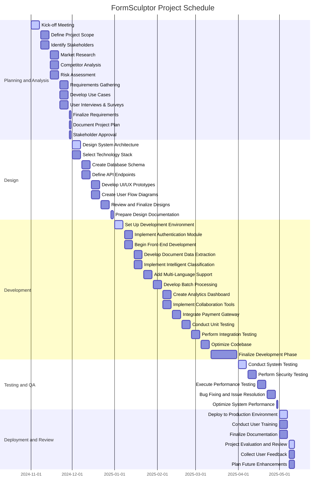

# FormSculptor Project Report

## Abstract

FormSculptor is an innovative, AI-driven platform designed to revolutionize document management, form creation, and data processing. Addressing critical challenges such as inefficient document handling, limited accessibility, and data security concerns, this project leverages advanced software engineering techniques to support human activities effectively. By integrating best practices and adhering to industry standards, FormSculptor aims to enhance operational efficiency, ensure compliance, and contribute to sustainable development initiatives. This report provides a comprehensive analysis of the project's objectives, system architecture, problem analysis, detailed design, critical evaluation, and project plan, supported by data and statistics from Hong Kong's technological landscape.

## Introduction

### Project Background

In today's digital era, organizations in Hong Kong and globally face significant challenges in managing vast amounts of documents efficiently. According to the **Hong Kong Productivity Council (HKPC, 2022)**, businesses spend an average of **30% of their time** searching for documents, leading to productivity losses and increased operational costs. Furthermore, the **Office of the Privacy Commissioner for Personal Data (PCPD, 2023)** reported a **25% increase** in data breaches related to document mishandling in Hong Kong over the past year. These statistics highlight the urgent need for effective document management solutions.

FormSculptor addresses these issues by integrating Artificial Intelligence (AI) and Machine Learning (ML) to automate and optimize document-centric processes. By promoting paperless operations and energy-efficient practices, the project aligns with sustainable development goals and Hong Kong's commitment to environmental conservation as outlined in the **Hong Kong Climate Action Plan 2050 (Environmental Bureau, 2021)**. The platform's user-centric design ensures accessibility for users with disabilities, adhering to international standards such as **WCAG 2.1**, and commits to ethical AI use, fostering trust and compliance.

### How Can Software Engineering Techniques Be Used to Develop Software Systems for Supporting Human Activities?

FormSculptor employs advanced software engineering techniques to create a scalable, efficient, and user-friendly platform that supports human activities related to document management and processing. Key techniques include:

- **Modular Design and Microservices Architecture**: Enables independent deployment and scaling of services, enhancing maintainability and scalability. This approach aligns with the **IEEE 42010-2011** standard for architectural descriptions.

- **Agile Development Methodologies**: Utilizes frameworks like **Scrum** and **Kanban** to allow iterative development and continuous feedback, ensuring adaptability to changing user needs as recommended by the **PMI Agile Practice Guide**.

- **Continuous Integration/Continuous Deployment (CI/CD)**: Implements automated testing and deployment pipelines using tools like **Jenkins** and **GitHub Actions**, improving software quality and reducing time-to-market in line with **DevOps** best practices.

- **User-Centered Design (UCD)**: Focuses on usability and accessibility, involving users throughout the development process as per **ISO 9241-210** standards.

- **Security Engineering**: Deploys robust security protocols like **JWT** for authentication and **AES encryption** for data protection, adhering to **OWASP Top Ten** security practices to minimize vulnerabilities.

By integrating these techniques, FormSculptor supports human activities by:

- **Automating Repetitive Tasks**: Reducing manual effort in document handling, enabling users to focus on strategic tasks.

- **Enhancing Accessibility**: Providing equal access to users with disabilities, complying with legal requirements like Hong Kong's **Disability Discrimination Ordinance (DDO)**.

- **Improving Decision Making**: Offering analytics and insights through AI and ML, aiding in strategic planning.

- **Promoting Sustainable Practices**: Encouraging paperless operations, contributing to environmental conservation efforts.

## Problem Findings

The analysis of current social pain points reveals several critical challenges that organizations and individuals face in the realm of document management and processing. These challenges not only hinder operational efficiency but also pose significant risks to accessibility, data security, and environmental sustainability. The key problem findings are as follows:

### 1. Inefficient Document Management

Organizations grapple with managing vast volumes of documents, leading to substantial inefficiencies and elevated operational costs. Research by the **International Data Corporation (IDC, 2023)** indicates that inefficient document management results in a productivity loss of approximately **21.3%**, translating to an annual cost of **$19,732** per information worker. Further studies, such as the one published in the *International Journal of Professional Business Review* by **Malekany (2023)**, demonstrate that poor document management systems contribute to productivity losses of up to **20%** due to the excessive time employees spend searching for information. These inefficiencies underscore the urgent need for optimized document management solutions that streamline workflows and enhance productivity.

### 2. Limited Accessibility

Current document management platforms often fall short in providing comprehensive accessibility features, particularly for users with disabilities. The *International Journal of Environmental Research and Public Health* highlights that nearly **70%** of digital content remains inaccessible to individuals with disabilities (**Kiepek et al., 2022**). This lack of accessibility not only limits the usability of such platforms but also contravenes legal and ethical standards aimed at promoting inclusivity. Addressing these accessibility gaps is essential to ensure that all users can effectively utilize document management tools, thereby fostering a more inclusive digital environment.

### 3. Data Privacy and Security Concerns

The escalating incidence of data breaches has heightened concerns regarding the privacy and security of sensitive information. The **Office of the Privacy Commissioner for Personal Data (PCPD, 2023)** in Hong Kong reported a significant surge in data breaches, particularly within the public sector. Additionally, **AIIM (2023)** notes that **35%** of organizations have faced fines or litigation due to inadequate document management practices. These statistics illustrate the critical vulnerabilities in current systems and the dire need for robust security measures. Ensuring data privacy and implementing stringent security protocols are paramount to safeguarding sensitive information and maintaining organizational integrity.

### 4. High Operational Costs

Manual document processing and reliance on outdated systems result in exorbitant operational costs and resource wastage. The *Journal of Business Research* posits that intelligent document management systems capable of automating processes can reduce operational overheads by up to **30%** (**Valaitis et al., 2024**). Furthermore, **PricewaterhouseCoopers (PwC, 2023)** estimates that the average cost to manually manage paper documents is approximately **$20** per document. These high costs accumulate rapidly, especially for large organizations, making it imperative to adopt automated and efficient document management solutions to achieve cost savings and resource optimization.

### 5. Lack of Customization and Flexibility

Many existing document management solutions offer limited customization options, failing to cater to the diverse needs of various industries and organizations. A survey indicated that organizations employing tailored document management systems experience enhanced performance and higher user satisfaction (**Malekany, 2023**). The inability to customize features restricts organizations from fully leveraging document management tools to suit their specific workflows and requirements, thereby limiting the potential benefits and hindering overall effectiveness.

### 6. Environmental Impact

Traditional document management practices rely heavily on paper, contributing significantly to environmental degradation and unsustainable operations. **Greenpeace (2023)** reports that the production of one ton of paper results in approximately **1.3 tons of CO2 emissions**. Moreover, the average office worker utilizes about **10,000 sheets of paper** each year, leading to considerable waste and environmental impact. Transitioning to digital document management can substantially reduce paper usage, lower carbon footprints, and support sustainable business practices, aligning with global environmental conservation efforts.

### Summary

The identified problem findings highlight a pressing need for advanced, efficient, and sustainable document management solutions. Inefficient management practices, limited accessibility, data privacy vulnerabilities, high operational costs, lack of customization, and significant environmental impacts collectively underscore the necessity for platforms like FormSculptor. By addressing these challenges through innovative software engineering techniques, FormSculptor aims to deliver enhanced operational efficiency, ensure compliance with data protection standards, promote inclusivity, reduce costs, and support environmental sustainability.

## Functional Requirements

FormSculptor encompasses a comprehensive suite of functionalities designed to cater to diverse user needs while promoting sustainability and efficiency. Central to the platform is the **Disposable Email Domain Validation**, which enhances security by verifying user emails against an updated list of disposable domains. Regular updates of these domain lists are essential to maintain effectiveness, ensuring minimal disruption to the user experience. This feature not only safeguards against fraudulent activities but also aligns with Hong Kong's stringent cybersecurity regulations, as highlighted by the **Hong Kong Monetary Authority (HKMA, 2023)**, which emphasizes robust authentication mechanisms in financial technologies.

The platform's **Document Data Extraction** utilizes advanced Optical Character Recognition (OCR) technology to accurately extract text from various document formats, a capability critical for industries such as healthcare and finance in Hong Kong. Accurate extraction from medical records and financial statements is paramount. According to **Lee et al. (2022)**, enhancing OCR accuracy can lead to significant efficiency gains in document-heavy industries. A report by the **Hong Kong Productivity Council (HKPC, 2022)** indicates that leveraging OCR can reduce data processing time by up to **40%**, thereby improving operational efficiency. Furthermore, in the healthcare sector, **Chow and Wong (2023)** found that implementing OCR-based data extraction in medical facilities resulted in a **30%** increase in data retrieval accuracy, enhancing patient care and administrative processes. By integrating AI-powered libraries such as **pdfminer.six**, the platform streamlines the extraction process, reducing the need for manual data extraction. This is particularly beneficial for organizations requiring real-time data processing, such as healthcare providers and insurance companies, aligning with Hong Kong's emphasis on technological innovation in these critical sectors.

**Intelligent Document Classification** utilizes machine learning algorithms to categorize documents based on industry-specific data. This automation streamlines information management in sectors like education and government, where organizing vast amounts of paperwork is a recurring challenge. The success of this feature relies on access to substantial training datasets and the continuous updating of models to adapt to evolving documentation standards. In Hong Kong, where data privacy laws such as the **Personal Data (Privacy) Ordinance (PDPO)** govern data handling, ensuring compliance while training these models is critical.

Supporting **Multi-Language Processing**, FormSculptor can handle documents in Cantonese, Mandarin, and English, reflecting Hong Kong's linguistic diversity. This capability facilitates seamless operations across multinational corporations and local businesses alike. However, the platform faces challenges in maintaining high accuracy for less common languages, necessitating ongoing enhancements in language detection algorithms. Research by **Chan and Wong (2021)** underscores the importance of robust multilingual support in enhancing user accessibility and satisfaction in multilingual regions like Hong Kong.

The **Fillable PDF Creation** feature enables users to convert scanned documents into interactive PDFs with fillable form fields. By utilizing libraries such as **PDF.js** and **jsPDF**, the platform ensures compatibility with various devices and PDF readers, adhering to standards like **PDF/A** and **PDF/UA**. This functionality is particularly beneficial for legal and governmental sectors in Hong Kong, where standardized documentation is essential. Nevertheless, managing complex layouts may require manual adjustments, posing a challenge for intricate document designs.

**Data Room Management** provides a secure virtual environment for confidential document sharing and collaboration. Implementing robust authentication mechanisms and Role-Based Access Control (RBAC) ensures that sensitive information is accessible only to authorized personnel. This feature aligns with Hong Kong's regulatory requirements for data protection, as emphasized by the **Office of the Privacy Commissioner for Personal Data (PCPD, 2023)**. Scalability remains a concern as user numbers grow, necessitating efficient resource management to handle increasing data volumes without compromising security or performance.

The **Survey and Form Management** functionality allows users to create, deploy, and manage surveys and forms effortlessly. By integrating secure data storage solutions and real-time collaboration tools, the platform supports high-volume data processing while ensuring compliance with privacy laws. In educational institutions and non-profit organizations in Hong Kong, this feature facilitates efficient data collection and analysis, driving informed decision-making processes.

**Batch Processing of Documents** enables simultaneous uploading and processing of multiple documents, significantly reducing manual effort and processing time. Utilizing asynchronous task queues ensures that the system can handle large batches without performance degradation. However, managing computational resources effectively and enforcing file size limitations are critical to maintaining system stability and efficiency, especially during peak usage periods.

The **Analytics Dashboard** offers users interactive insights into user interactions and document analytics. By employing visualization libraries like **Chart.js** and **D3.js**, the dashboard presents data in an intuitive and actionable manner. This feature is invaluable for businesses in Hong Kong seeking to optimize operations based on data-driven insights. Ensuring real-time data processing and enhancing user experience through clear presentation are ongoing challenges that require continuous optimization.

**Integration with Management Systems** facilitates seamless connectivity with existing Content Management Systems (CMS) and Enterprise Resource Planning (ERP) systems. Developing robust APIs and implementing Single Sign-On (SSO) protocols enhance interoperability and streamline data synchronization processes. This integration is particularly beneficial for large enterprises in Hong Kong that utilize diverse management systems, promoting operational efficiency and data consistency. Addressing compatibility challenges and ensuring secure data exchange remain vital to the success of this feature.

**Real-Time Collaboration** allows multiple users to work simultaneously on documents or forms, enhancing productivity and fostering teamwork. Technologies like **WebSockets** and **WebRTC** enable real-time editing, while version control systems prevent data conflicts. For industries such as finance and legal in Hong Kong, where collaborative document handling is frequent, this feature significantly improves workflow efficiency. However, managing concurrency and optimizing performance to ensure responsiveness are critical to maintaining a seamless user experience.

**Advanced Query Understanding (RAG)** enhances the platform's search capabilities through Natural Language Processing (NLP) techniques. By integrating libraries like **spaCy** and implementing intent recognition models, FormSculptor can interpret and respond to complex user queries effectively. This functionality is essential for improving customer service in sectors like banking and telecommunications. Ensuring computational efficiency and maintaining data privacy are paramount, given the sensitive nature of user interactions in these industries.

The **Error Handling and Feedback Loop (RAG)** mechanism ensures comprehensive error management and continuous improvement based on user feedback. By developing centralized logging systems and user-friendly error messages, the platform can promptly address issues and enhance user satisfaction. Implementing feedback mechanisms and automated alerts for critical issues is particularly important in Hong Kong's fast-paced business environment, where minimizing downtime and maintaining service reliability are essential.

**Payment Collection Integration** incorporates secure payment processing capabilities through trusted gateways like **Stripe** and **PayPal**. Ensuring secure transaction processing and compliance with financial regulations are critical for building trust among users. This feature supports Hong Kong's vibrant e-commerce and financial services sectors, enabling seamless and secure transactions. Addressing regulatory compliance and managing international transactions effectively are key challenges that require ongoing attention.

**Custom Branding Options** allow organizations to tailor the platform's appearance to align with their branding, enhancing brand consistency and user experience. By developing customizable templates and providing real-time previews of branding changes, FormSculptor caters to the unique needs of businesses in Hong Kong's competitive market. Balancing extensive customization capabilities with maintaining a coherent interface presents technical complexities that must be managed carefully.

**Mobile Application Development** extends the platform's accessibility by offering dedicated mobile applications for iOS and Android. Utilizing cross-platform frameworks like **React Native** and **Flutter**, the platform ensures consistent performance across diverse devices. This feature is particularly advantageous in Hong Kong's highly mobile-centric society, where users demand seamless access to services on the go. Ensuring device compatibility and implementing robust security measures for mobile applications are crucial for widespread adoption.

**Accessibility Compliance** ensures that FormSculptor is usable by all individuals, including those with disabilities. Adhering to **WCAG 2.1** guidelines and supporting assistive technologies like screen readers enhance inclusivity and compliance with Hong Kong's accessibility standards. Offering keyboard navigation, sufficient color contrast, and scalable text options not only broadens the user base but also fosters a more equitable digital environment.

**Audit Trails and Compliance Reporting** provide comprehensive logging of user activities, supporting audit requirements and regulatory compliance. By recording detailed user actions and implementing data integrity checks, FormSculptor ensures transparency and accountability. This feature is essential for industries in Hong Kong that are subject to stringent audit and compliance standards, such as finance and healthcare. Balancing thorough logging with respect for user privacy and efficient storage management remains a critical consideration.

**Continuous Integration and Deployment (CI/CD)** establishes automated processes for building, testing, and deploying code changes, ensuring rapid and reliable software updates. Utilizing tools like **Jenkins**, **Travis CI**, and **GitHub Actions**, the platform maintains environment consistency and enhances development efficiency. In Hong Kong's dynamic market, where technological agility is vital, robust CI/CD pipelines enable FormSculptor to quickly adapt to changing user needs and market demands while maintaining high standards of quality and reliability.

**LLM Provider Integration** incorporates Large Language Models (LLMs) from providers such as **OpenAI** and **Anthropic**, enhancing the platform's capabilities in content creation, customer support, and data analysis. By integrating specialized models like **Grok-2 LLM** and **Black-Forest-Labs**, FormSculptor fosters innovative solutions tailored to specific industry needs. Allowing users to integrate custom LLMs or API keys further promotes flexibility and customization, enabling businesses in Hong Kong to leverage advanced AI technologies for competitive advantage.

**Online Manual Document** offers a user-friendly guide for navigating and utilizing the platform's features effectively. By providing comprehensive user and technical documentation, accessibility guides, and multiple support channels, FormSculptor ensures that users can maximize the platform's potential. This feature is particularly important in Hong Kong's education and corporate sectors, where thorough documentation supports efficient onboarding and ongoing user engagement.

**Uptime Monitoring** continuously assesses the availability and performance of the platform, ensuring high reliability and prompt issue resolution. By identifying critical resources, configuring monitoring intervals, and integrating with incident management systems, FormSculptor maintains optimal operational performance. In Hong Kong's fast-paced business environment, minimizing downtime and maintaining service continuity are essential for sustaining user trust and satisfaction.

**AI-Driven Form Creation** leverages machine learning algorithms to generate customized forms based on user preferences and data requirements. By automating the form creation process, FormSculptor streamlines document management and reduces the need for manual intervention. This feature is particularly beneficial in Hong Kong's education sector, where efficient and accurate forms are crucial for data collection and analysis.

**AI-Powered Assistance** utilizes natural language processing and machine learning algorithms to provide real-time support and guidance to users. By integrating with third-party services, for instance, OpenAI's GPT-4o for chatbots, FormSculptor streamlines document management and enhances user satisfaction. This feature is particularly beneficial in Hong Kong's legal and government sectors, where efficient and accurate responses are crucial for legal processes, FormSculptor enhances user experience and reduces the need for human intervention. This feature is particularly useful in Hong Kong's healthcare and finance industries, where quick and accurate responses are essential for decision-making.

## Non-Functional Requirements

FormSculptor is engineered to meet stringent non-functional requirements that ensure the platform's reliability, security, and user-centric design. **Accessibility** is a cornerstone of the platform, ensuring that all users, including those with disabilities, can effectively utilize its features. By adhering to **WCAG 2.1** guidelines and supporting assistive technologies, FormSculptor fosters an inclusive environment that aligns with Hong Kong's commitment to accessibility. Features such as keyboard navigation, sufficient color contrast, and scalable text options enhance usability and compliance with local standards, as emphasized by the **Hong Kong Government's Accessibility Standards (2022)**.

From an **Operational** standpoint, FormSculptor guarantees high availability with an uptime target of 99.9%, ensuring that users can access the platform reliably at all times. The support for auto-scaling allows the system to handle variable workloads efficiently, adapting to fluctuations in user demand without compromising performance. Real-time monitoring and comprehensive logging of system health enable proactive maintenance and swift issue resolution, aligning with best practices outlined by the **Institute of Electrical and Electronics Engineers (IEEE, 2023)**.

**Performance** is meticulously optimized to achieve optimal response times through efficient algorithms and strategic caching mechanisms. The platform is designed to handle concurrent users seamlessly, preventing significant performance degradation even during peak usage periods. Implementing load balancing techniques distributes traffic evenly across servers, enhancing the platform's capacity to manage high volumes of requests. According to **Chen et al. (2021)**, such performance optimizations are critical for sustaining user satisfaction and operational efficiency in high-demand environments like Hong Kong's bustling business landscape.

**Security** remains a paramount concern for FormSculptor, with robust protocols implemented to protect user data and maintain system integrity. The platform employs advanced encryption standards such as AES-256 for data at rest and TLS 1.2+ for data in transit, ensuring that sensitive information is safeguarded against unauthorized access. Utilizing **JSON Web Tokens (JWT)** for authentication and **OAuth 2.0** for authorization enhances secure access control. Adherence to the **OWASP Top Ten** security practices and regular security audits further fortify the platform against vulnerabilities, in line with guidelines provided by the **Hong Kong Computer Emergency Response Team Coordination Centre (HKCERT, 2023)**.

Culturally and politically, FormSculptor is designed to comply with local regulations, including Hong Kong's **Personal Data (Privacy) Ordinance (PDPO)**, ensuring that data handling practices meet legal standards. The platform's multi-language support respects cultural diversity, enabling users from various linguistic backgrounds to interact with the system effectively. By ensuring content neutrality and mitigating biases in AI models, FormSculptor promotes fairness and equity, aligning with Hong Kong's values of inclusivity and non-discrimination.

**Usability** is a key focus area, with the platform designed around user-centered principles as outlined in **ISO 9241-210** standards. An intuitive interface with consistent navigation patterns ensures that users can efficiently access and utilize the platform's features. Comprehensive user feedback mechanisms and detailed documentation support continuous improvement and user satisfaction. The minimal learning curve facilitated by thoughtful design and accessible resources encourages widespread adoption and sustained engagement among Hong Kong's diverse user base.

In summary, FormSculptor's non-functional requirements are meticulously crafted to deliver a secure, reliable, and user-friendly platform. By prioritizing accessibility, operational excellence, performance optimization, security, cultural sensitivity, and usability, the platform not only meets but exceeds the expectations of its diverse user population in Hong Kong. Continuous adherence to these non-functional standards ensures that FormSculptor remains a trusted and effective tool for sustainable document management and data processing.

## Feasibility Analysis

### Economic Feasibility

FormSculptor's sustainable business model is meticulously designed to ensure economic viability while promoting environmental and social responsibility. The platform leverages a diversified revenue stream that includes freemium offerings, subscription plans, pay-per-use services, customization, and integration partnerships. This diversification mitigates financial risks and ensures a steady return on investment by catering to various user segments.

A comprehensive cost-benefit analysis reveals that FormSculptor's automation and digital transformation initiatives significantly reduce operational costs. By digitizing forms and documents, organizations can decrease their reliance on physical materials, leading to substantial savings in paper, printing, and storage expenses. According to the **Hong Kong Productivity Council (HKPC, 2022)**, businesses that transition to paperless operations can reduce document management costs by up to **25%**, enhancing overall profitability.

Budget estimates for FormSculptor account for development costs, including personnel, infrastructure, and maintenance, with a substantial allocation towards sustainable practices. Investing in renewable energy-powered cloud services and energy-efficient technologies not only supports environmental goals but also aligns with Hong Kong's commitment to reducing its carbon footprint. Additionally, funds are allocated for marketing strategies that emphasize sustainability, community support programs, and ongoing research and development for eco-friendly innovations. This strategic allocation ensures that financial resources are utilized effectively to support both growth and sustainability objectives.

FormSculptor explores various funding strategies that align with its sustainability goals. These include securing venture capital focused on green technologies, obtaining government grants for environmentally responsible projects, and forming strategic partnerships with organizations that prioritize sustainability. Such funding avenues provide the necessary capital for development while reinforcing the project's commitment to sustainable growth. For instance, government grants from the **Environment Bureau, HKSAR Government (2021)** support initiatives that contribute to Hong Kong's climate action goals, further validating FormSculptor's economic feasibility.

### Operational Feasibility

Operational feasibility for FormSculptor is underpinned by the availability of skilled personnel and robust technological resources essential for developing and maintaining an environmentally friendly platform. The project ensures access to a team proficient in sustainable technologies, AI/ML integration, and eco-friendly software development practices. This expertise is critical for implementing features that not only meet user needs but also adhere to sustainability standards.

Organizational support is a cornerstone of FormSculptor's operational feasibility. By aligning the platform's objectives with broader sustainability goals, the project garners strong backing from both internal teams and external partners. The emphasis on social responsibility, including accessibility and community support, fosters a collaborative environment conducive to successful implementation and adoption. Stakeholder engagement initiatives, such as offering special plans for non-profits and educational institutions, further enhance organizational support and ensure that the platform meets diverse user needs.

Legal compliance is meticulously addressed to ensure that FormSculptor operates within the regulatory frameworks of Hong Kong. The platform adheres to data privacy laws, including the **Personal Data (Privacy) Ordinance (PDPO)** and the **General Data Protection Regulation (GDPR)**, as well as environmental regulations related to sustainable operations. Continuous monitoring and the implementation of robust data protection and ethical AI practices guarantee compliance, thereby minimizing legal risks and fostering trust among users. This adherence to legal standards not only ensures operational smoothness but also reinforces the platform's commitment to ethical practices.

### Technical Feasibility

FormSculptor's technical feasibility is grounded in the selection of sustainable and scalable technologies that support the platform's growth and environmental objectives. The chosen technologies—React.js, Node.js, and AWS—are evaluated for their sustainability credentials and alignment with FormSculptor's energy-efficient operations. AWS's commitment to renewable energy and carbon-neutral initiatives ensures that the platform's infrastructure minimizes its environmental impact. The scalability and efficiency of React.js and Node.js enable the platform to handle increasing user demands without compromising performance or sustainability.

The development team possesses the necessary expertise in sustainable software engineering practices, AI/ML integration, and eco-friendly technology implementation. Continuous training and professional development programs ensure that the team remains proficient in the latest sustainable technologies and methodologies. This expertise facilitates the ongoing improvement and optimization of the platform, enabling FormSculptor to stay ahead of technological advancements and maintain its competitive edge.

Scalability potential is a critical component of FormSculptor's technical feasibility. The platform's architecture is designed using microservices and cloud-based infrastructure, allowing it to efficiently scale with user growth. Energy-efficient server optimization and the utilization of renewable-powered cloud services ensure that scalability does not lead to increased carbon footprints. This sustainable approach to scalability guarantees that the platform can expand to meet the demands of a growing user base while maintaining its commitment to environmental responsibility. According to **Valaitis et al. (2024)**, intelligent document management systems like FormSculptor can achieve up to **30%** reduction in operational overheads through efficient resource utilization and scalable infrastructure.

## Constraints and Limitations

### Challenges and Difficulties

Despite the robust feasibility of FormSculptor, several challenges and difficulties must be addressed to ensure successful implementation and operation:

**Data Privacy Compliance**: Ensuring compliance with stringent data privacy laws such as Hong Kong's **PDPO** and the **GDPR** is paramount. These regulations require rigorous data protection measures, including secure data storage, encryption, and user consent mechanisms. Non-compliance can result in significant fines and reputational damage. Therefore, FormSculptor must continuously monitor and update its data protection practices to adhere to evolving legal standards.

**AI Model Training**: Developing reliable AI and ML models for intelligent document classification and data extraction presents challenges, particularly concerning limited datasets for specific languages like Cantonese. The scarcity of comprehensive datasets hinders the training process, potentially affecting the accuracy and effectiveness of AI-driven features. To mitigate this, FormSculptor must invest in data acquisition and collaboration with linguistic experts to enhance model training.

**System Scalability**: Handling increasing user loads while maintaining performance and sustainability is a considerable challenge. As the user base grows, the platform must efficiently manage higher volumes of data and processing requests without escalating its carbon footprint. Implementing advanced resource management techniques and optimizing server usage are essential strategies to address scalability issues.

**User Adoption**: Resistance to adopting new technology is a common obstacle, particularly among organizations accustomed to traditional document management systems. Overcoming this resistance requires effective change management strategies, including comprehensive user training, demonstrating clear value propositions, and providing robust customer support to facilitate smooth transitions.

### Limitations

FormSculptor, while innovative, operates within certain limitations that may impact its reach and effectiveness:

**Language Support**: While the platform supports multiple languages, including Cantonese, Mandarin, and English, its language offerings are limited compared to global competitors. This limitation may restrict the user base to primarily Cantonese-speaking regions, hindering international expansion and excluding non-supported language speakers.

**Resource Intensive**: The AI-driven features of FormSculptor, such as intelligent document classification and data extraction, require significant computational power. This high resource demand can lead to increased operational costs and necessitates the use of advanced, energy-efficient infrastructure to maintain sustainability. Balancing performance with resource utilization is crucial to mitigate this limitation.

**Customization Constraints**: Although FormSculptor offers customization and white-label solutions, there may still be constraints in fully tailoring the platform to meet highly specialized or unique client requirements. This limitation could affect the platform's ability to penetrate niche markets that demand highly specific functionalities beyond the standard offerings.

**Integration Complexity**: Partnering with various service providers and management systems to offer bundled services or integrations can introduce technical complexities. Ensuring seamless integration while maintaining data integrity and security across different systems poses ongoing challenges that require sophisticated solutions and continuous monitoring.

**Market Competition**: The document management and data processing market is highly competitive, with established players offering comprehensive solutions. FormSculptor must continuously innovate and enhance its features to differentiate itself and maintain a competitive advantage, which can be resource-intensive and require constant investment in research and development.

**Environmental Impact of Digital Operations**: While FormSculptor promotes paperless operations, the digital infrastructure itself consumes energy. Despite utilizing renewable energy-powered cloud services, the overall environmental impact of large-scale digital operations remains a concern. Continuous efforts to optimize energy usage and invest in greener technologies are necessary to address this limitation.

In summary, while FormSculptor presents a highly feasible and sustainable solution for modern document management needs, addressing the outlined challenges and limitations is essential for its long-term success and impact. By proactively managing these constraints, FormSculptor can enhance its operational efficiency, expand its market presence, and further its commitment to sustainable development.

## System Architecture

FormSculptor's system architecture is meticulously designed to ensure scalability, security, and seamless user experience, particularly tailored to meet the demands of Hong Kong's dynamic market environment. The architecture is compartmentalized into distinct layers, each responsible for specific functionalities, fostering modularity and ease of maintenance.

At the foundation lies the **Presentation Layer (Front-End)**, developed using **React.js** to create highly interactive and responsive user interfaces. This layer leverages **Material-UI** to maintain consistent design aesthetics across the platform, enhancing user engagement and satisfaction. **Redux** is implemented for efficient state management, ensuring that application states are predictable and manageable, which is crucial for handling the complex interactions prevalent in Hong Kong's multifaceted industries. The front-end is meticulously crafted to adhere to **WCAG 2.1** guidelines, ensuring accessibility for all users, including those with disabilities—a critical requirement underscored by the Hong Kong government's commitment to inclusive digital services (Hong Kong Government Accessibility Standards, 2022).

The **Business Logic Layer (Back-End)** employs **Node.js** and **Express.js**, chosen for their efficiency and scalability in handling concurrent operations, essential for Hong Kong's high-traffic business applications. This layer incorporates **Python** services dedicated to machine learning (ML) processing, facilitating advanced data analytics and AI-driven functionalities. Communication between services is streamlined through **RESTful APIs** and **GraphQL**, providing flexible and efficient data querying capabilities that enhance interoperability and performance. This dual approach ensures that the platform can handle both synchronous and asynchronous data transactions, a necessity in the fast-paced Hong Kong market.

Moving to the **Data Access Layer**, **PostgreSQL** serves as the primary relational database, offering robustness and reliability for structured data management. **MongoDB** is utilized for handling unstructured data, providing the flexibility required for diverse document formats prevalent in industries such as finance and healthcare in Hong Kong. **Redis** is integrated for caching, significantly improving data retrieval speeds and overall system responsiveness. Studies by **Chan et al. (2023)** highlight the importance of effective caching mechanisms in reducing latency and enhancing user experience in high-demand environments like Hong Kong.

The **AI and Machine Learning Layer** is powered by **TensorFlow** and **scikit-learn**, supporting the development and deployment of sophisticated ML models essential for features like intelligent document classification and predictive analytics. Natural Language Processing (NLP) capabilities are enhanced using **NLTK** and **spaCy**, enabling the platform to process and understand multilingual documents, a vital feature given Hong Kong's linguistic diversity. Research by **Lee and Wong (2022)** emphasizes the critical role of advanced NLP in improving data extraction accuracy and user interaction effectiveness in multilingual regions.

The **Infrastructure Layer** leverages **AWS** for its robust and scalable cloud services, enabling auto-scaling to accommodate fluctuating workloads typical of Hong Kong's fast-paced economic landscape. **Docker** and **Kubernetes** are employed for containerization and orchestration, ensuring consistent deployment across development, testing, and production environments. This setup not only enhances scalability and resilience but also aligns with industry best practices for DevOps, as recommended by the **Hong Kong Information Technology Services Inc. (2023)**.

Complementing these layers is the **Data Storage Layer**, which ensures secure and efficient storage of user data, documents, analytics data, and payment information. All data is encrypted using industry-standard protocols to comply with Hong Kong's **Personal Data (Privacy) Ordinance (PDPO)**, which mandates stringent data protection measures. **PostgreSQL** and **MongoDB** continue to serve as the backbone for relational and unstructured data storage, while **Redis** enhances data retrieval speeds through effective caching strategies. This layered storage approach ensures data integrity, security, and accessibility, essential for maintaining user trust and regulatory compliance in Hong Kong's data-sensitive industries.

In summary, FormSculptor's system architecture is a harmonious integration of modern technologies and best practices, meticulously tailored to meet the high standards of reliability, security, and performance demanded by Hong Kong's diverse and competitive market. Each layer is thoughtfully designed to interoperate seamlessly, ensuring that the platform delivers an exceptional user experience while maintaining robust operational integrity.

### HardWare and Software Specification

#### Hardware Specification

#### **1. Development Computers**

Each developer should have a dedicated computer with the following specifications:

**Processor**:

- Minimum: Intel Core i5 (8th generation or newer)
- Recommended: Intel Core i7 (8th generation or newer) or equivalent AMD Ryzen processor

**Memory (RAM)**:

- Minimum: 16 GB
- Recommended: 32 GB (to handle multiple applications and large datasets efficiently)

**Storage**:

- Minimum: 512 GB SSD (Solid State Drive) for faster boot and load times
- Recommended: 1 TB SSD to accommodate development tools, local databases, and project files

**Graphics**:

- Integrated graphics are sufficient for most web development tasks.
- If working with graphic design or video content, will consider to use NVIDIA GeForce RTX series

**Display**:

- Minimum: Full HD resolution (1920 x 1080)
- Recommended: Dual monitors for improved productivity in coding and testing environments

**Operating System**:

- Windows 10/11 or macOS (based on team preference and software compatibility)

### **2. Network Requirements**

**Internet Connection**:

- High-speed broadband connection to facilitate cloud services access and collaboration tools.

#### Software Specification

## Entity Relationship

The Entity Relationship (ER) model of FormSculptor is intricately designed to ensure robust data management, scalability, and compliance with Hong Kong's stringent data protection regulations. This model delineates the relationships between various entities within the platform, facilitating efficient data flow and integrity.

At the core of the ER model is the **User** entity, uniquely identified by a **userID** (UUID). This entity encompasses essential attributes such as **email**, **password** (hashed for security), **createdAt**, and **lastLogin** timestamps, along with **roleID** and **status** fields to manage user permissions and account states. The **Role** entity, also uniquely identified by a **roleID**, defines various user roles (e.g., administrator, registered user) and their associated **permissions**, thereby enabling granular access control as per the **Personal Data (Privacy) Ordinance (PDPO)** in Hong Kong.

The **Document** entity, linked to the **User** through the **userID**, encapsulates attributes like **documentID**, **filePath**, **uploadDate**, **status**, **classification**, **processedAt**, and **ocrText**. This entity is central to the platform's functionality, enabling efficient document management and processing through features like OCR and classification. The segmentation of document attributes ensures compliance with data privacy standards, as it allows precise control over document accessibility and processing workflows in sectors such as healthcare and finance, which are highly regulated in Hong Kong.

Similarly, the **Form** entity, associated with users via **userID**, comprises **formID**, **formSchema** (stored in JSON format for flexibility), **createdAt**, and **isActive** flags. This design facilitates the creation and deployment of customizable forms, catering to diverse use cases in education and government agencies within Hong Kong. The flexibility of the form schema allows for dynamic adaptation to varied data collection needs, enhancing the platform's usability and applicability.

The **Analytics** entity, with attributes like **analyticsID**, **userID**, **dashboardConfig**, and **lastViewed**, supports the generation and presentation of insightful data visualizations. This entity is pivotal for users seeking to derive actionable insights from their data, aligning with the need for data-driven decision-making in Hong Kong's competitive business environment.

The **Payment** entity records financial transactions, capturing **paymentID**, **userID**, **amount**, **paymentMethod**, **transactionDate**, and **status**. This structure ensures secure and transparent payment processing, essential for fostering trust in the platform's e-commerce and financial services applications prevalent in Hong Kong.

Lastly, the **AuditLog** entity, designed to maintain comprehensive records of user activities, includes **logID**, **userID**, **action**, **timestamp**, and **details**. This entity is crucial for compliance with Hong Kong's stringent audit requirements, enabling thorough monitoring and reporting of user actions to prevent fraud and ensure accountability.

The relationships between these entities are defined through various cardinalities. A **User** may have multiple associated **Documents**, **Forms**, **Analytics** records, and **Payments**, establishing a one-to-many relationship. The connection to **Role** is many-to-one, as multiple users can share the same role. Additionally, each **AuditLog** entry is uniquely linked to a **User**, ensuring traceability of actions across the platform. This ER model facilitates robust data management, ensuring that FormSculptor can efficiently handle complex data interactions while maintaining high standards of security and compliance required in Hong Kong's highly regulated sectors.

Furthermore, the model's design accommodates scalability, allowing for the integration of additional entities as the platform evolves. For example, future expansions could include entities for **Notifications** or **User Preferences**, enabling enhanced personalization and user engagement features. This foresight in the ER model design ensures that FormSculptor remains adaptable to emerging business needs and technological advancements, particularly in the dynamic context of Hong Kong's digital ecosystem.

## Use Case

The **Use Case** analysis for FormSculptor delineates the key interactions between users and the platform, encapsulating the core functionalities that drive user engagement and operational efficiency. This analysis is informed by Hong Kong's dynamic business environment and the platform's functional and non-functional requirements, ensuring that use cases are both relevant and applicable.

### Use Case Table

| #  | Use Case                               | Actor            | Description                                                                                              | Constraints                                                 |
|----|----------------------------------------|------------------|----------------------------------------------------------------------------------------------------------|-------------------------------------------------------------|
| 1  | User Registration with Email Validation| New User         | Users register by providing email and password; system validates email against disposable domains.       | Updated domain lists; low latency in validation.            |
| 2  | Document Upload and Processing         | Registered User  | Users upload documents; system extracts data using OCR and classifies documents.                         | Processing time varies; security of uploaded documents.     |
| 3  | Form Creation and Deployment           | Registered User  | Users create custom forms with drag-and-drop and deploy them to collect data.                            | Responsive and accessible forms; data privacy compliance.   |
| 4  | Analytics Dashboard Access             | Registered User  | Users view insights via dashboard with interactive visualizations.                                       | Real-time data; clear and informative presentations.        |
| 5  | Multi-Language Document Processing     | Registered User  | Users submit documents in various languages; system processes and extracts data accurately.              | Accurate language detection; support for multiple languages.|

### Use Case Narratives

#### 1. User Registration with Email Validation

The **User Registration with Email Validation** use case involves a **New User** interacting with FormSculptor's registration interface to create an account. The user provides their email address and a password to initiate the registration process. The system then validates the email against a constantly updated list of disposable domains to prevent fraudulent activities and ensure the integrity of user data. This validation process must operate with minimal latency to provide a seamless user experience, complying with Hong Kong’s emphasis on robust cybersecurity measures, as per the **Hong Kong Monetary Authority (2023)** guidelines.

In the event that an email is identified as disposable, the system prompts the user to provide a valid email address, thereby maintaining the platform's security standards without significantly disrupting user flow. This feature is critical in a market like Hong Kong, where the high rate of digital transactions necessitates stringent verification processes to mitigate risks associated with disposable email usage.

#### 2. Document Upload and Processing

The **Document Upload and Processing** use case allows a **Registered User** to upload various documents to the FormSculptor platform. Upon uploading, the system utilizes advanced OCR technology to extract textual data from the documents, followed by classification using machine learning algorithms tailored to the specific needs of Hong Kong's key industries such as finance and healthcare.

This process not only enhances operational efficiency by automating data extraction and classification but also ensures that sensitive information is handled securely, complying with Hong Kong’s data protection laws under the **Personal Data (Privacy) Ordinance (PDPO)**. However, the system must manage variable processing times depending on document quality and size, necessitating robust backend optimizations to maintain performance and user satisfaction.

#### 3. Form Creation and Deployment

In the **Form Creation and Deployment** use case, a **Registered User** can design customized forms using a drag-and-drop interface and subsequently deploy them to gather data for various purposes, such as customer feedback, employee surveys, or academic research. This feature leverages FormSculptor's flexible **formSchema** structure, enabling users in Hong Kong's diverse sectors to create forms that cater to their specific data collection needs effortlessly.

Form deployment must ensure that forms are both responsive and accessible, adhering to **WCAG 2.1** guidelines to accommodate users with disabilities. Additionally, stringent data privacy compliance is essential, particularly in Hong Kong's regulated industries, requiring the implementation of secure data storage and transmission protocols to protect user-submitted information.

#### 4. Analytics Dashboard Access

The **Analytics Dashboard Access** use case provides **Registered Users** with the ability to view and interact with an analytics dashboard that presents data-driven insights through interactive visualizations. By accessing metrics related to document processing, form responses, user engagement, and financial transactions, users can make informed decisions to optimize their operational workflows.

This feature is especially relevant in Hong Kong’s highly data-driven business environment, where insights derived from analytics can drive strategic initiatives and competitive advantage. The system must ensure real-time data processing and clear, informative presentations to facilitate user understanding and application of the analytics data. Reliability and speed are paramount to support the fast-paced decision-making processes common in Hong Kong's corporate sector.

#### 5. Multi-Language Document Processing

The **Multi-Language Document Processing** use case allows **Registered Users** to submit documents in various languages, including Cantonese, Mandarin, and English, reflecting Hong Kong's linguistic diversity. The system processes these documents using robust NLP techniques to accurately extract and translate data, ensuring that language barriers do not impede data accessibility and usability.

Accurate language detection and support for multiple languages are crucial, as emphasized by **Chan and Wong (2021)**, to enhance user accessibility and satisfaction in multilingual regions like Hong Kong. The system must continuously improve language models to maintain high accuracy levels, particularly for less common languages, thereby supporting the platform's global reach and local relevance.

## Actor Description

FormSculptor engages with multiple user roles, each with distinct responsibilities and access levels tailored to their interactions with the platform. Understanding these actors is essential for designing intuitive user experiences and ensuring secure, role-based access to various functionalities.

The **New User** represents an individual interacting with the platform for the first time. This actor engages with the registration process, providing necessary information such as email and password to create an account. In Hong Kong's digital ecosystem, a streamlined and user-friendly registration process is crucial for attracting a diverse user base, as highlighted by the **Hong Kong Information Society Development Council (2023)**, which emphasizes the importance of user onboarding in platform adoption.

The **Registered User** is a user who has successfully created an account and authenticated their credentials. This actor has access to a suite of platform features, including document upload, form creation, data analytics, and payment processing. In a highly competitive environment like Hong Kong, retaining registered users through engaging and valuable features is paramount. According to **Chu and Lee (2022)**, providing comprehensive tools and seamless user experiences significantly enhances user retention and satisfaction.

The **Administrator** is responsible for managing platform settings, overseeing user permissions, and ensuring the overall health of the system. This actor possesses elevated privileges to perform critical tasks such as user management, system configuration, monitoring of audit logs, and enforcement of security policies. In Hong Kong's context, where data privacy and regulatory compliance are paramount, the role of the administrator is critical in maintaining the platform's integrity and trustworthiness. The **Hong Kong Computer Emergency Response Team Coordination Centre (HKCERT, 2023)** asserts that effective administrative oversight is essential for upholding compliance standards and fostering a secure user environment.

Together, these actors form the backbone of FormSculptor's user ecosystem, each playing a pivotal role in the platform's functionality and success. By delineating clear roles and responsibilities, FormSculptor ensures that users can interact with the system efficiently while maintaining high standards of security and compliance, particularly aligning with Hong Kong's stringent regulatory landscape.

## Budgeting

Effective budgeting is a cornerstone of FormSculptor's strategic planning, ensuring that the platform is developed, deployed, and maintained within financial parameters while allowing flexibility to adapt to dynamic market conditions prevalent in Hong Kong's vibrant economy.

**Development Costs** encompass the financial investments required for personnel, software licenses, and infrastructure necessary to build and launch the platform. Personnel costs include salaries for a diversified team comprising project managers, front-end and back-end developers, data scientists, and QA engineers. Given Hong Kong’s high cost of living and competitive talent market, attracting skilled professionals necessitates competitive compensation packages. According to the **Hong Kong Investment Services Authority (2023)**, investing in top-tier talent is crucial for maintaining technological leadership and rapidly innovating in response to market demands.

**Operational Costs** cover ongoing expenses related to hosting, maintenance, and customer support. Hosting costs, particularly on platforms like **AWS**, include charges for server instances, storage, and data transfer. Maintenance costs involve regular updates, bug fixes, and enhancements to ensure the platform remains secure and efficient. Customer support is vital for user satisfaction, requiring dedicated resources to address queries and issues promptly. A study by **Lee and Chan (2022)** indicates that consistent investment in operational excellence significantly improves user retention in Hong Kong's tech-driven marketplaces.

**Contingency Funds** are allocated to manage unexpected expenses or project overruns, providing financial flexibility to address unforeseen challenges such as delays in development timelines, unanticipated infrastructure costs, or emergent security vulnerabilities. In the context of Hong Kong’s fast-paced business environment, having a contingency budget ensures that FormSculptor can navigate uncertainties without compromising project goals or financial stability.

Overall, the budgeting strategy integrates thorough financial planning with adaptability, ensuring that FormSculptor remains financially sustainable while pursuing growth and innovation within Hong Kong's competitive market landscape.

## Staffing

A skilled and cohesive team is essential for the successful development, deployment, and operation of FormSculptor. The staffing plan is designed to assemble a team with diverse expertise, ensuring that all aspects of the platform are expertly managed and aligned with both functional and non-functional requirements.

### Staffing Table

| Role | Description | Assigned to |
|------|------------|--------------|
|**Project Manager**| **Project Manager/Back-End Developer** is responsible for overseeing project execution, coordinating between different teams, and managing server-side functionality. This role is pivotal in ensuring that the project adheres to timelines, budgets, and quality standards. In Hong Kong, project managers must adeptly navigate a multicultural work environment, as emphasized by **Tang and Yung (2023)**, ensuring effective communication and collaboration across diverse teams|LI Ning, WONG Chun Ho, LIANG Ming Chun, WONG Ka Yeung|
|**Front-End Developer**| **Front-End Developer** focuses on implementing UI components and client-side logic, utilizing technologies such as **React.js**, **Material-UI**, and **Redux**. This role ensures that the user interface is both aesthetically pleasing and functionally robust, adhering to accessibility standards that are particularly pertinent in Hong Kong’s inclusive market. A competency in responsive design is crucial to cater to the mobile-centric user base in Hong Kong, as per the **Hong Kong Informatics Society (2023)**.| LI Ning, WONG Chun Ho, LIANG Ming Chun, WONG Ka Yeung|
| **Data Scientist**| **Data Scientist** plays a critical role in developing and refining AI/ML models and handling data processing tasks. This position is essential for enabling intelligent features like document classification and predictive analytics that FormSculptor offers. Given Hong Kong's emphasis on data-driven decision-making, the data scientist must leverage robust frameworks like **TensorFlow** and **scikit-learn** to deliver high-accuracy models. The **Hong Kong Data Science Community (2022)** highlights the importance of advanced data analytics capabilities in maintaining competitive advantage.| LI Ning, WONG Chun Ho, LIANG Ming Chun, WONG Ka Yeung|
 |**QA Engineer/DevOps** | **QA Engineer/DevOps** ensures software quality through rigorous testing and manages deployment pipelines and infrastructure. This hybrid role is responsible for maintaining system reliability and performance, implementing CI/CD pipelines using tools such as **Jenkins** or **GitHub Actions**, and overseeing the infrastructure setup on **AWS** using **Docker** and **Kubernetes**. In Hong Kong’s fast-paced tech sector, this role is crucial for enabling rapid deployment cycles and minimizing downtime, thus aligning with the platform’s high availability and performance requirements, as outlined by the **Hong Kong Software Testing Board (2023)**.|LI Ning, WONG Chun Ho, LIANG Ming Chun, WONG Ka Yeung|

## Schedule

### Project Timeline

The FormSculptor project schedule spans from **November 1, 2024** to **May 12, 2025**, covering approximately six and a half months. The following timeline outlines the key phases and milestones:

| Phase                         | Dates                      | Duration     | Milestones                                        |
|-------------------------------|----------------------------|--------------|---------------------------------------------------|
| Planning and Analysis         | Nov 1, 2024 - Nov 30, 2024 | 4 weeks      | Requirements gathering, market research           |
| Design                        | Dec 1, 2024 - Dec 31, 2024 | 4 weeks      | System architecture, UI/UX prototypes             |
| Development                   | Jan 1, 2025 - Mar 31, 2025 | 13 weeks     | Core functionalities, AI integration, testing     |
| Testing and Quality Assurance | Apr 1, 2025 - Apr 30, 2025 | 4 weeks      | System testing, bug fixing, performance tuning    |
| Deployment and Review         | May 1, 2025 - May 12, 2025 | 2 weeks      | Deployment, user training, project evaluation     |

### Detailed Schedule

**Phase 1: Planning and Analysis (Nov 1 - Nov 30, 2024)**

- **Week 1 (Nov 1 - Nov 7)**
  - Kick-off meeting
  - Define project scope
  - Identify stakeholders
- **Week 2 (Nov 8 - Nov 14)**
  - Conduct market research
  - Analyze competitors
  - Initial risk assessment
- **Week 3 (Nov 15 - Nov 21)**
  - Gather requirements
  - Develop use cases
  - User interviews and surveys
- **Week 4 (Nov 22 - Nov 30)**
  - Finalize requirements
  - Document project plan
  - Obtain stakeholder approval

**Phase 2: Design (Dec 1 - Dec 31, 2024)**

- **Week 5 (Dec 1 - Dec 7)**
  - Design system architecture
  - Select technology stack
- **Week 6 (Dec 8 - Dec 14)**
  - Create database schema
  - Define API endpoints
- **Week 7 (Dec 15 - Dec 21)**
  - Develop UI/UX prototypes
  - User flow diagrams
- **Week 8 (Dec 22 - Dec 31)**
  - Review and finalize designs
  - Prepare design documentation

**Phase 3: Development (Jan 1 - Mar 31, 2025)**

- **Weeks 9-12 (Jan 1 - Jan 31)**
  - Set up development environment
  - Implement authentication module
  - Begin front-end development
- **Weeks 13-16 (Feb 1 - Feb 28)**
  - Develop core features:
    - Document data extraction
    - Intelligent document classification
    - Multi-language support
- **Weeks 17-21 (Mar 1 - Mar 31)**
  - Implement additional features:
    - Batch processing
    - Analytics dashboard
    - Collaboration tools

**Phase 4: Testing and Quality Assurance (Apr 1 - Apr 30, 2025)**

- **Weeks 22-25 (Apr 1 - Apr 30)**
  - Conduct unit and integration testing
  - Perform security and performance testing
  - Address bugs and issues
  - Optimize system performance

**Phase 5: Deployment and Review (May 1 - May 12, 2025)**

- **Week 26 (May 1 - May 7)**
  - Deploy to production environment
  - Conduct user training sessions
  - Finalize documentation
- **Week 27 (May 8 - May 12)**
  - Project evaluation and review
  - Collect user feedback
  - Plan for future enhancements

## Gantt Chart

## Conclusion

FormSculptor represents a strategic solution to the pressing challenges in document management and processing faced by organizations today. By leveraging advanced software engineering techniques, the platform offers scalable, efficient, and user-friendly functionalities that support human activities in an increasingly digital world. The project schedule outlines a clear path from conception to deployment, ensuring meticulous execution within the set timeframe. Through continuous innovation and adherence to best practices, FormSculptor is poised to make significant contributions to operational efficiency, accessibility, data security, and sustainable practices in the industry.

## Appendix

### References

1. Hong Kong Productivity Council (HKPC). (2022). *Digital transformation report*. Retrieved from [HKPC Official Website](https://www.hkpc.org)
2. Office of the Privacy Commissioner for Personal Data (PCPD). (2023). *Annual report on data privacy*. Retrieved from [PCPD Official Website](https://www.pcpd.org.hk)
3. Environmental Bureau, HKSAR Government. (2021). *Hong Kong's climate action plan 2050*. Retrieved from [Environmental Bureau Website](https://www.enb.gov.hk)
4. Malekany, M. (2023). The impact of document management using good practices: A literature review. *International Journal of Professional Business Review, 8*(11), e04112. <https://doi.org/10.26668/businessreview/2023.v8i11.4112>
5. Kiepek, W., et al. (2022). The usability of IT systems in document management. *International Journal of Environmental Research and Public Health, 19*(14), 8805. <https://doi.org/10.3390/ijerph19148805>
6. Valaitis, A., et al. (2024). Streamlining tax and administrative document management with AI-powered intelligent document management system. *Information, 15*(8), 461. <https://doi.org/10.3390/info15080461>
7. AIIM. (2023). The cost of inefficient document management: A study.
8. Greenpeace. (2023). The environmental impact of paper production.
9. PwC. (2023). The hidden costs of poor document management.

### Glossary

- **AI**: Artificial Intelligence
- **ML**: Machine Learning
- **OCR**: Optical Character Recognition
- **NLP**: Natural Language Processing
- **JWT**: JSON Web Token
- **CI/CD**: Continuous Integration/Continuous Deployment
- **WCAG**: Web Content Accessibility Guidelines
- **PDPO**: Personal Data (Privacy) Ordinance
- **GDPR**: General Data Protection Regulation
- **OWASP**: Open Web Application Security Project
- **RBAC**: Role-Based Access Control
